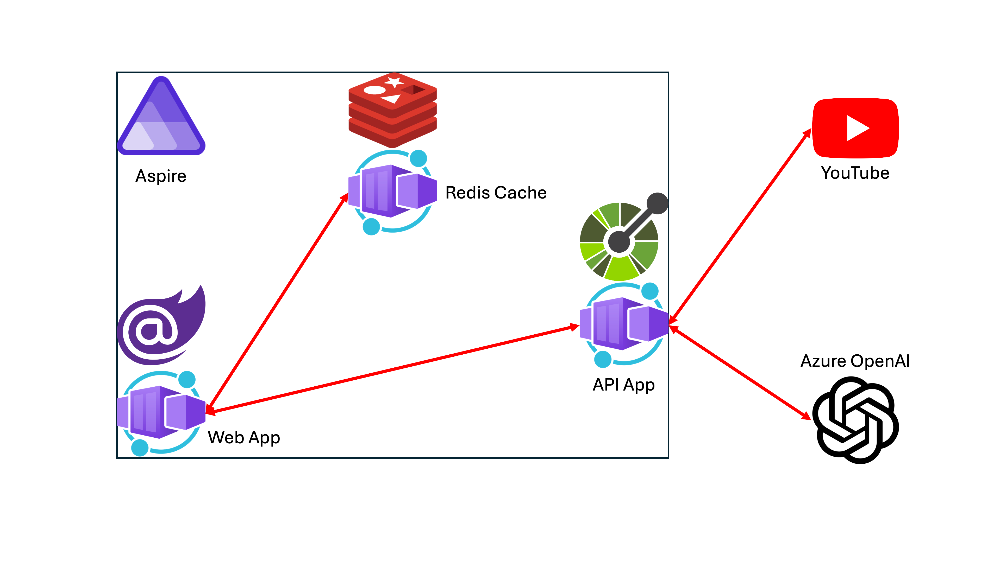

# Aspire App Dev in a Day

[GitHub Codespaces](https://docs.github.com/ko/codespaces/overview)와 [GitHub Copilot](https://docs.github.com/ko/copilot/overview-of-github-copilot/about-github-copilot-business)을 이용해서 [.NET Aspire](https://learn.microsoft.com/ko-kr/dotnet/aspire/get-started/aspire-overview?WT.mc_id=dotnet-121695-juyoo) 기반의 [Cloud-Native 앱](https://learn.microsoft.com/ko-kr/dotnet/architecture/cloud-native/?WT.mc_id=dotnet-121695-juyoo)을 개발해 보는 핸즈온 워크샵 자료입니다.

## Prerequisites

이 워크샵을 진행하기 위해서는 아래와 같은 준비사항이 필요합니다.

- [GitHub Account](https://github.com/signup) 및 GitHub Copilot 구독 ([개인](https://docs.github.com/ko/copilot/overview-of-github-copilot/about-github-copilot-individual), [비지니스](https://docs.github.com/ko/copilot/overview-of-github-copilot/about-github-copilot-business) 또는 [엔터프라이즈](https://docs.github.com/ko/copilot/github-copilot-enterprise/overview/about-github-copilot-enterprise))
- [Visual Studio 2022 17.10+](https://visualstudio.microsoft.com/?WT.mc_id=dotnet-121695-juyoo) 또는 [Visual Studio Code](https://code.visualstudio.com/?WT.mc_id=dotnet-121695-juyoo) + [C# Dev Kit 익스텐션](https://marketplace.visualstudio.com/items?itemName=ms-dotnettools.csdevkit&WT.mc_id=dotnet-121695-juyoo)
- [.NET 8 SDK](https://dotnet.microsoft.com/ko-kr/download/dotnet/8.0?WT.mc_id=dotnet-121695-juyoo) + [Aspire 워크로드](https://learn.microsoft.com/ko-kr/dotnet/core/tools/dotnet-workload-install?WT.mc_id=dotnet-121695-juyoo)
- [node.js](https://nodejs.org/en/download) (선택)
- [Azure 구독](https://azure.microsoft.com/ko-kr/free/?WT.mc_id=dotnet-121695-juyoo)
- [Azure OpenAI 서비스 구독](https://aka.ms/aoaiapply)
- [Docker Desktop](https://docs.docker.com/desktop/) 또는 [Podman](https://podman.io/docs/installation)
- [Azure Developer CLI](https://learn.microsoft.com/ko-kr/azure/developer/azure-developer-cli/overview?WT.mc_id=dotnet-121695-juyoo)
- [Azure CLI](https://learn.microsoft.com/ko-kr/cli/azure/what-is-azure-cli?WT.mc_id=dotnet-121695-juyoo)
- [GitHub CLI](https://cli.github.com/)

## Getting Started

1. 이 리포지토리를 자신의 GitHub 계정으로 포크한 후 자신의 컴퓨터에 클론한 후 [이 문서](./docs/00-setup.md)부터 시작합니다.
2. 각 세션을 끝마치지 못했을 경우 이전 세션의 [세이브 포인트](./save-points)에서 시작할 수 있습니다.
3. 최종 완성본은 [`src`](./src) 디렉토리에서 확인할 수 있습니다.

## Sessions

| 세션                                            | 제목                                           |
|-------------------------------------------------|------------------------------------------------|
| [Session 00](./docs/00-setup.md)                | 개발 환경 설정                                 |
| [Session 01](./docs/01-blazor-frontend.md)      | Blazor 프론트엔드 웹 앱 개발                   |
| [Session 02](./docs/02-aspnet-core-backend.md)  | ASP.NET Core 백엔드 API 앱 개발                |
| [Session 03](./docs/03-aspire-integration.md)   | Aspire 통합                                    |
| [Session 04](./docs/04-azure-deployment-aca.md) | Azure 배포 &ndash; Azure Container Apps        |
| [Session 05](./docs/04-azure-deployment-aks.md) | Azure 배포 &ndash; Azure Kubernetes Service    |
| [Session 06](./docs/06-blazor-js-interop.md)    | Blazor JavaScript Interoperability 적용 (선택) |
| [Session 07](./docs/07-semantic-kernel.md)      | Semantic Kernel 앱 개발 (선택)                 |

## Resources

- [What is Blazor?](https://learn.microsoft.com/ko-kr/aspnet/core/blazor?WT.mc_id=dotnet-121695-juyoo)
- [Build your first Blazor app](https://dotnet.microsoft.com/ko-kr/apps/aspnet/web-apps/blazor?WT.mc_id=dotnet-121695-juyoo)
- [What is Aspire?](https://learn.microsoft.com/ko-kr/dotnet/aspire/get-started/aspire-overview?WT.mc_id=dotnet-121695-juyoo)
- [Build your first Aspire app](https://learn.microsoft.com/ko-kr/dotnet/aspire/get-started/quickstart-build-your-first-aspire-app?tabs=dotnet-cli&WT.mc_id=dotnet-121695-juyoo)
- [What is GitHub Copilot?](https://docs.github.com/ko/copilot)
- [Building an intelligent app with Blazor and Azure OpenAI](https://www.youtube.com/watch?v=TH12YSLLe9E&t=8464s)
- [Your stack for building Cloud Native apps](https://www.youtube.com/live/5IjKH-gy2Y0?si=dSMvC7arUeRpqBmz)
- [Blazor JavaScript Interoperability](https://learn.microsoft.com/ko-kr/aspnet/core/blazor/javascript-interoperability/?WT.mc_id=dotnet-121695-juyoo)
- [Semantic Kernel](https://learn.microsoft.com/ko-kr/semantic-kernel/overview/?WT.mc_id=dotnet-121695-juyoo)
