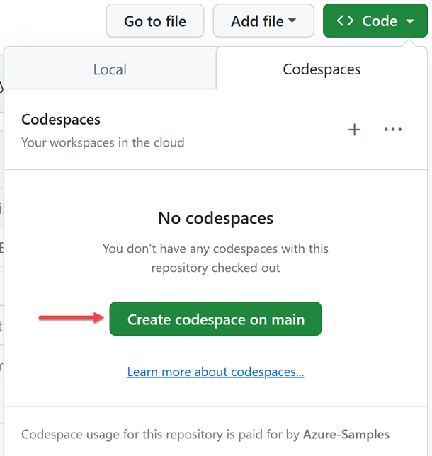

# 세션 00: 개발 환경 설정

이 세션에서는 워크샵 진행을 위해 필요한 개발 환경 설정을 진행합니다.

## Azure OpenAI 프록시 구독 신청

1. 아래 링크를 클릭해서 Azure OpenAI 프록시 구독을 신청합니다. 구독 신청시 GitHub ID로 로그인해야 합니다.

   👉 구독 신청 링크: [https://aka.ms/aspireinadaykr/request](https://aka.ms/aspireinadaykr/request)

1. 로그인 후 화면에서 API키와 Endpoint 값을 확인합니다.

<!-- ## Azure OpenAI 프록시 구독 및 GitHub Copilot 구독 신청

1. 아래 링크를 클릭해서 Azure OpenAI 프록시 구독 및 GitHub Copilot 구독을 신청합니다.

   👉 구독 신청 링크: [https://aka.ms/aspireinadaykr/request](https://aka.ms/aspireinadaykr/request)

1. 신청한 이메일을 통해 `DoNotReply@aoai.kr` 발신자로 Azure OpenAI 프록시 구독 코드 및 GitHub Copilot 구독 코드가 온 것을 확인합니다.
1. 아래 링크를 통해 GitHub Copilot 구독을 마무리합니다.

   👉 GitHub Copilot 구독 신청 링크: [https://github.com/redeem](https://github.com/redeem) -->

<!--
1. 아래 링크를 통해 Azure OpenAI 프록시 코드가 제대로 작동하는지 확인합니다.

   👉 Azure OpenAI 프록시 플레이그라운드 링크: [https://proxy.aoai.kr/playground](https://proxy.aoai.kr/playground)
-->

## GitHub Codespaces 시작

1. 이 리포지토리를 자신의 GitHub 계정으로 포크합니다.
1. 포크한 리포지토리에서 GitHub Codespaces 인스턴스를 생성합니다.

    

1. GitHub 코드스페이스의 터미널에서 아래 명령어를 실행시켜 현재 리포지토리의 위치를 확인합니다.

    ```bash
    git remote -v
    ```

   이 명령어를 실행하면 아래와 같은 결과가 나와야 합니다. 만약 `origin`에 `Azure-Samples`가 보이면 코드스페이스를 자신의 리포지토리에서 다시 만들어야 합니다.

    ```bash
    origin  https://github.com/<자신의 GitHub ID>/aspire-app-dev-in-a-day-ko (fetch)
    origin  https://github.com/<자신의 GitHub ID>/aspire-app-dev-in-a-day-ko (push)
    upstream        https://github.com/Azure-Samples/aspire-app-dev-in-a-day-ko.git (fetch)
    upstream        https://github.com/Azure-Samples/aspire-app-dev-in-a-day-ko.git (push)
    ```

## Visual Studio Code 시작

1. 이 리포지토리를 자신의 GitHub 계정으로 포크합니다.
1. 포크한 리포지토리에서 자신의 컴퓨터로 클론합니다.

    ```bash
    git clone https://github.com/<자신의 GitHub ID>/aspire-app-dev-in-a-day-ko.git
    ```

1. Visual Studio Code를 실행한 후 터미널에서 아래 명령어를 실행시켜 현재 리포지토리의 위치를 확인합니다.

    ```bash
    git remote -v
    ```

   이 명령어를 실행하면 아래와 같은 결과가 나와야 합니다. 만약 `origin`에 `Azure-Samples`가 보이면 자신의 리포지토리에서 다시 클론해야 합니다.

    ```bash
    origin  https://github.com/<자신의 GitHub ID>/aspire-app-dev-in-a-day-ko (fetch)
    origin  https://github.com/<자신의 GitHub ID>/aspire-app-dev-in-a-day-ko (push)
    upstream        https://github.com/Azure-Samples/aspire-app-dev-in-a-day-ko.git (fetch)
    upstream        https://github.com/Azure-Samples/aspire-app-dev-in-a-day-ko.git (push)
    ```

1. 아래 명령어를 실행시켜 현재 설치된 .NET SDK 버전을 확인합니다.

    ```bash
    dotnet --list-sdks
    ```

   `8.0.300` 이상의 버전이 설치되어 있어야 합니다. 없을 경우 [.NET SDK 설치 페이지](https://dotnet.microsoft.com/download/dotnet/8.0?WT.mc_id=dotnet-121695-juyoo)에서 최신 버전을 다운로드 받아 설치합니다.

1. 아래 명령어를 실행시켜 [C# Dev Kit 익스텐션](https://marketplace.visualstudio.com/items?itemName=ms-dotnettools.csdevkit&WT.mc_id=dotnet-121695-juyoo)이 설치되어 있는지 확인합니다.

    ```bash
    # bash/zsh
    code --list-extensions | grep "ms-dotnettools.csdevkit"
    
    # PowerShell
    code --list-extensions | Select-String "ms-dotnettools.csdevkit"
    ```

1. 만약 설치되어 있지 않다면 설치합니다.

    ```bash
    code --install-extension "ms-dotnettools.csdevkit" --force
    ```

---

축하합니다! 개발 환경 설정이 끝났습니다. 이제 [Session 01: Blazor 프론트엔드 웹 앱 개발](./01-blazor-frontend.md)로 넘어가세요.
