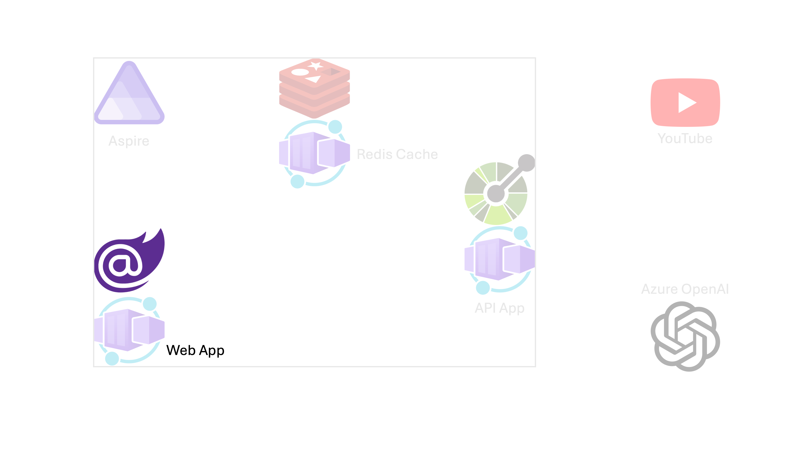
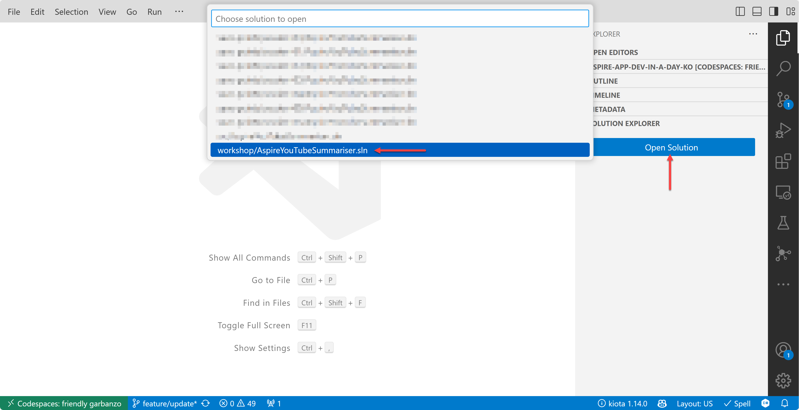
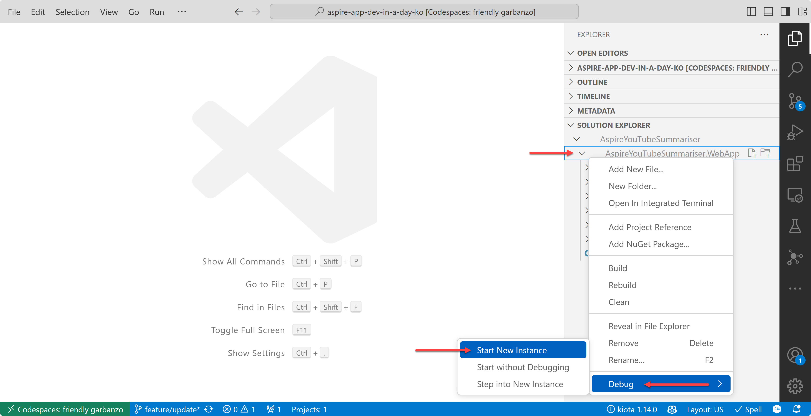
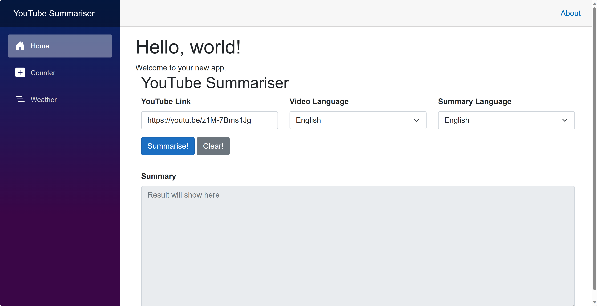
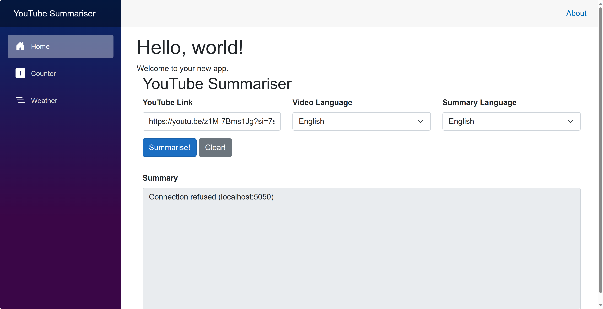
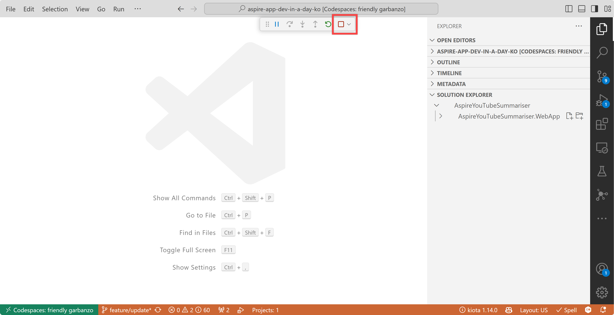

# 세션 01: Blazor 프론트엔드 웹 앱 개발

이 세션에서는 [GitHub Copilot](https://docs.github.com/ko/copilot/overview-of-github-copilot/about-github-copilot-business) 기능을 활용해 빠르게 [Blazor 프론트엔드 웹 앱](https://learn.microsoft.com/ko-kr/aspnet/core/blazor?WT.mc_id=dotnet-121695-juyoo) 개발을 해 보겠습니다.

> [GitHub Codespaces](https://docs.github.com/ko/codespaces/overview) 또는 [Visual Studio Code](https://code.visualstudio.com/?WT.mc_id=dotnet-121695-juyoo) 환경에서 작업하는 것을 기준으로 합니다.



## 01-1: Blazor 프로젝트 생성하기

1. 터미널을 열고 아래 명령어를 차례로 실행시켜 실습 디렉토리를 만들고 이동합니다.

    ```bash
    # GitHub Codespaces
    REPOSITORY_ROOT=$CODESPACE_VSCODE_FOLDER
    mkdir -p $REPOSITORY_ROOT/workshop
    cd $REPOSITORY_ROOT/workshop

    # bash/zsh
    REPOSITORY_ROOT=$(git rev-parse --show-toplevel)
    mkdir -p $REPOSITORY_ROOT/workshop
    cd $REPOSITORY_ROOT/workshop

    # PowerShell
    $REPOSITORY_ROOT = git rev-parse --show-toplevel
    New-Item -Type Directory -Path $REPOSITORY_ROOT/workshop -Force
    cd $REPOSITORY_ROOT/workshop
    ```

1. 아래 명령어를 차례로 실행시켜 Blazor 웹 앱 프로젝트를 생성합니다.

    ```bash
    dotnet new sln -n AspireYouTubeSummariser
    dotnet new blazor -n AspireYouTubeSummariser.WebApp
    dotnet sln add AspireYouTubeSummariser.WebApp
    ```

1. 아래 명령어를 차례로 실행시켜 Blazor 웹 앱 프로젝트를 빌드하고 실행시킵니다.

    ```bash
    dotnet restore && dotnet build
    dotnet watch run --project AspireYouTubeSummariser.WebApp
    ```

1. 실행이 잘 되는 것을 확인하면 터미널 창에서 `CTRL`+`C` 키를 눌러 실행을 중지합니다.

> 여기까지 생성한 프로젝트는 [save-points/session-00](../save-points/session-00/)에서 확인할 수 있습니다.

## 01-2: UI Component 생성하기

> 세이브 포인트에서 가져온 프로젝트를 사용하려면 아래 명령어를 차례로 실행시켜 프로젝트를 복원합니다.
> 
> ```bash
> # bash/zsh
> cd $REPOSITORY_ROOT
> mkdir -p workshop && cp -a save-points/session-00/. workshop/
> cd workshop
> dotnet restore && dotnet build
> 
> # PowerShell
> cd $REPOSITORY_ROOT
> New-Item -Type Directory -Path workshop -Force && Copy-Item -Path ./save-points/session-00/* -Destination ./workshop -Recurse -Force
> cd workshop
> dotnet restore && dotnet build
> ```

1. Solution Explorer에서 솔루션을 엽니다.

   

1. Solution Explorer 또는 아래 명령어를 실행시켜 `Components` 디렉토리 밑에 `UI` 디렉토리를 생성합니다.

    ```bash
    # bash/zsh
    mkdir -p $REPOSITORY_ROOT/workshop/AspireYouTubeSummariser.WebApp/Components/UI

    # PowerShell
    New-Item -Type Directory -Path $REPOSITORY_ROOT/workshop/AspireYouTubeSummariser.WebApp/Components/UI -Force
    ```

1. Solution Explorer 또는 아래 명령어를 통해 `UI` 디렉토리 밑에 `YouTubeSummariserComponent`라는 이름으로 Razor Component 파일을 생성합니다.

    ```bash
    # bash/zsh
    touch $REPOSITORY_ROOT/workshop/AspireYouTubeSummariser.WebApp/Components/UI/YouTubeSummariserComponent.razor

    # PowerShell
    New-Item -Type File -Path $REPOSITORY_ROOT/workshop/AspireYouTubeSummariser.WebApp/Components/UI/YouTubeSummariserComponent.razor -Force
    ```

   > Soultion Explorer를 통해 파일을 생성했다면 아래와 비슷한 내용이 이미 들어 있습니다.
   > 
   > ```razor
   > <h3>YouTubeSummariserComponent</h3>
   > 
   > @code {
   > 
   > }
   > ```

1. 위 내용을 모두 지운 후 `CTRL`+`I` 키 또는 `CMD`+`I` 키를 눌러 GitHub Copilot Chat 창을 활성화 시킵니다.
1. 아래 프롬프트를 GitHub Copilot Chat에 입력합니다.

    ```text
    It's a razor component of a Blazor app. Add the following input controls with Bootstrap style:
    
    - 1 text input for YouTube link URL
    - 1 drop down list for the video language code selection of English and Korean
    - 1 drop down list for the summary language code selection of English and Korean
    - 2 buttons for summary and clear
    - 1 textarea for summary result
    
    Also add the corresponding code block.
    ```

   그러면 아래와 비슷한 코드를 자동으로 만들어 줄 것입니다. 아래 코드를 참고해서 `YouTubeSummariserComponent.razor` 파일을 수정합니다.

    ```razor
    <div class="container">
        <div class="row">
            <h2>YouTube Summariser</h2>
        </div>

        <div class="row">
            <div class="col">
                <div class="mb-3">
                    <label for="youtube-link" class="form-label"><strong>YouTube Link</strong></label>
                    <input class="form-control" id="youtube-link" placeholder="Add YouTube link here" @bind="youTubeLinkUrl" />
                </div>
            </div>
            <div class="col">
                <div class="mb-3">
                    <label for="video-language-code" class="form-label"><strong>Video Language</strong></label>
                    <select class="form-select" id="video-language-code" aria-label="Video language code" @bind="videoLanguageCode">
                        <option value="en" selected>English</option>
                        <option value="ko">Korean</option>
                    </select>
                </div>
            </div>
            <div class="col">
                <div class="mb-3">
                    <label for="summary-language-code" class="form-label"><strong>Summary Language</strong></label>
                    <select class="form-select" id="summary-language-code" aria-label="Summary language code" @bind="summaryLanguageCode">
                        <option value="en" selected>English</option>
                        <option value="ko">Korean</option>
                    </select>
                </div>
            </div>
        </div>

        <div class="row">
            <div class="mb-3">
                <button type="button" class="btn btn-primary" @onclick="SummariseAsync">Summarise!</button>
                <button type="button" class="btn btn-secondary" @onclick="ClearAsync">Clear!</button>
            </div>
        </div>

        <div class="row">
            <div class="mb-3">
                <label for="summary" class="form-label"><strong>Summary</strong></label>
                <textarea class="form-control" id="summary" rows="10" placeholder="Result will show here" readonly>@summaryResult</textarea>
            </div>
        </div>
    </div>

    @code {
        private string youTubeLinkUrl = string.Empty;
        private string videoLanguageCode = "en";
        private string summaryLanguageCode = "en";
        private string summaryResult = string.Empty;

        private async Task SummariseAsync()
        {
            throw new NotImplementedException();
        }

        private async Task ClearAsync()
        {
            throw new NotImplementedException();
        }
    }
    ```

1. `YouTubeSummariserComponent.razor` 파일의 맨 처음에 아래 내용을 입력합니다.

    ```razor
    @using AspireYouTubeSummariser.WebApp.Clients
    @inject IApiAppClient ApiApp
    ```

1. `YouTubeSummariserComponent.razor` 파일의 `SummariseAsync` 메서드 안에서 다시 GitHub Copilot Chat을 이용해 코드를 입력합니다.

    ```text
    call ApiApp.SummariseAsync method with proper exception handling logic.
    ```

   그러면 아래와 비슷한 코드를 자동으로 만들어 줄 것입니다. 아래 코드를 참고해서 `SummariseAsync` 메서드를 수정합니다.

    ```razor
    private async Task SummariseAsync()
    {
        try
        {
            var result = await ApiApp.SummariseAsync(youTubeLinkUrl, videoLanguageCode, summaryLanguageCode);
            summaryResult = result;
        }
        catch (Exception ex)
        {
            summaryResult = ex.Message;
        }
    }
    ```

1. `YouTubeSummariserComponent.razor` 파일의 `ClearAsync` 메서드를 아래와 같이 수정합니다.

    ```razor
    private async Task ClearAsync()
    {
        youTubeLinkUrl = string.Empty;
        videoLanguageCode = "en";
        summaryLanguageCode = "en";
        summaryResult = string.Empty;

        await Task.CompletedTask;
    }
    ```

## 01-3: API Client 생성하기

1. Solution Explorer 또는 아래 명령어를 통해 `Clients` 디렉토리를 생성하고 그 안에 `ApiAppClient`라는 이름으로 C# 클래스 파일을 생성합니다.

    ```bash
    # bash/zsh
    mkdir -p $REPOSITORY_ROOT/workshop/AspireYouTubeSummariser.WebApp/Clients
    touch $REPOSITORY_ROOT/workshop/AspireYouTubeSummariser.WebApp/Clients/ApiAppClient.cs

    # PowerShell
    New-Item -Type Directory -Path $REPOSITORY_ROOT/workshop/AspireYouTubeSummariser.WebApp/Clients -Force
    New-Item -Type File -Path $REPOSITORY_ROOT/workshop/AspireYouTubeSummariser.WebApp/Clients/ApiAppClient.cs -Force
    ```

1. 생성된 파일 안에는 아래와 비슷한 내용이 이미 들어 있습니다. 만약 내용이 없다면 아래 코드를 입력합니다.

    ```csharp
    namespace AspireYouTubeSummariser.WebApp.Clients;

    public class ApiAppClient
    {

    }
    ```

1. `namespace`와 `class` 사이에서 GitHub Copilot Chat을 이용해 아래와 같이 프롬프트를 입력합니다.

    ```text
    create an interface of IApiAppClient that has a SummariseAsync method with parameters of YouTube link, video language code and summary language code
    ```

   그러면 아래와 비슷한 코드를 자동으로 만들어 줄 것입니다. 아래 코드를 참고해서 `ApiAppClient` 파일을 수정합니다.

    ```csharp
    public interface IApiAppClient
    {
        Task<string> SummariseAsync(string youTubeLinkUrl, string videoLanguageCode, string summaryLanguageCode);
    }
    ```

1. GitHub Copilot Chat을 이용해서 클래스를 수정합니다.

    ```text
    create a class implementing IApiAppClient
    ```

   그러면 아래와 비슷한 코드를 자동으로 만들어 줄 것입니다. 아래 코드를 참고해서 `ApiAppClient` 파일을 수정합니다.

    ```csharp
    public class ApiAppClient : IApiAppClient
    {
        public async Task<string> SummariseAsync(string youTubeLinkUrl, string videoLanguageCode, string summaryLanguageCode)
        {
            throw new NotImplementedException();
        }
    }
    ```

## 01-4: API Client에 의존성 주입하기

1. Solution Explorer에서 `Program.cs` 파일을 열고 `var app = builder.Build();` 라인 바로 위에 아래와 같이 `ApiAppClient`에 대한 의존성 주입을 추가합니다.

    ```csharp
    builder.Services.AddHttpClient<IApiAppClient, ApiAppClient>(p => p.BaseAddress = new Uri("http://localhost:5050"));
    ```

   > 포트번호 `5050`은 임의의 번호로써, 나중에 변경해야 합니다.

1. 그러면 네임스페이스 참조를 할 수 없다는 오류가 발생합니다. 오류가 발생한 곳에 커서를 두고 `CTRL`+`.` 키 또는 `CMD`+`.` 키를 눌러 네임스페이스를 추가합니다.
1. 다시 `ApiAppClient.cs` 파일을 열어 아래와 같이 생성자를 통해 `HttpClient` 인스턴스를 주입받도록 수정합니다.

    ```csharp
    public class ApiAppClient(HttpClient http) : IApiAppClient
    {
        private readonly HttpClient _http = http ?? throw new ArgumentNullException(nameof(http));

        public async Task<string> SummariseAsync(string youTubeLinkUrl, string videoLanguageCode, string summaryLanguageCode)
    ```

1. 다시 `SummariseAsync` 메서드를 아래와 같이 수정합니다.

    ```csharp
    public async Task<string> SummariseAsync(string youTubeLinkUrl, string videoLanguageCode, string summaryLanguageCode)
    {
        using var response = await _http.PostAsJsonAsync(
            "summarise",
            new { youTubeLinkUrl, videoLanguageCode, summaryLanguageCode }).ConfigureAwait(false);

        var summary = await response.Content.ReadAsStringAsync().ConfigureAwait(false);
        return summary;
    }
    ```

## 01-5: UI Component 페이지에 추가하기

1. Solution Explorer에서 `Components/Pages` 디렉토리 밑에 `Home.razor` 파일을 엽니다.

1. 페이지의 맨 아래에 아래와 같이 `YouTubeSummariserComponent`를 추가합니다.

    ```razor
    <YouTubeSummariserComponent @rendermode="InteractiveServer" />
    ```

1. 네임스페이스 참조를 할 수 없다는 오류가 발생합니다. 오류가 발생한 곳에 커서를 두고 `CTRL`+`.` 키 또는 `CMD`+`.` 키를 눌러 네임스페이스를 추가합니다.

## 01-6: Blazor 웹 앱 실행하기

1. Solution Explorer에서 `AspireYouTubeSummariser.WebApp` 프로젝트를 선택하고 마우스 오른쪽 버튼을 눌러 디버깅 모드로 실행합니다.

    

   > 또는 터미널에서 아래 명령어를 차례로 실행시켜 Blazor 웹 앱을 실행합니다.
   > 
   > ```bash
   > cd $REPOSITORY_ROOT/workshop
   > dotnet watch run --project AspireYouTubeSummariser.WebApp
   > ```

1. 첫 화면에서 아래와 같이 YouTube 링크를 입력하고 `Summarise!` 버튼을 클릭합니다.

    

   > YouTube 링크는 무엇이든 상관 없습니다. 여기서는 [https://youtu.be/z1M-7Bms1Jg](https://youtu.be/z1M-7Bms1Jg) 링크를 사용합니다.

1. 아래와 같이 에러 메시지가 나오는 것을 확인합니다. "Connection refused" 등의 에러 메시지가 나올 수 있습니다.

    

   > 이 에러는 아직 백엔드 API 앱을 연결하지 않았기 때문에 나오는 에러입니다. 백엔드 API 앱을 개발하고 연결하면 이 에러는 사라집니다.

1. 아래와 같이 사각형 모양을 클릭하여 디버깅 모드를 중지합니다.

    

   > 앞서 터미널에서 `dotnet watch run ...` 명령어를 통해 Blazor 웹 앱을 실행했다면 `CTRL`+`C` 키를 눌러 실행을 중지합니다.

---

축하합니다! Blazor 프론트엔드 웹 앱 개발이 끝났습니다. 이제 [Session 02: ASP.NET Core 백엔드 API 앱 개발](./02-aspnet-core-backend.md)로 넘어가세요.
