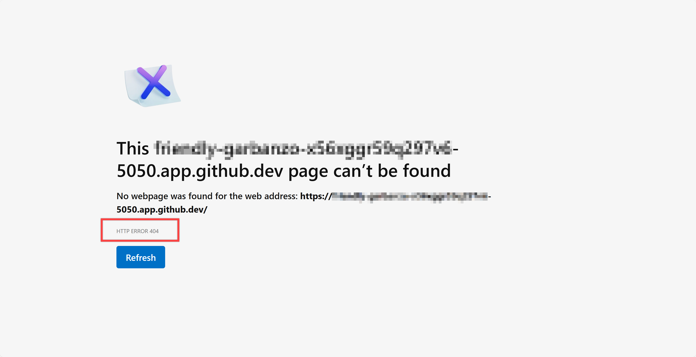
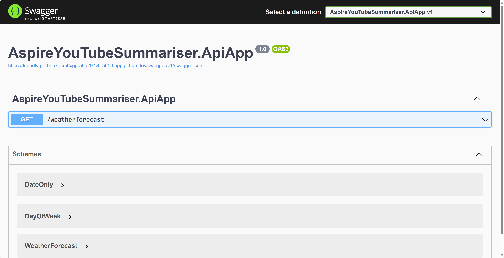
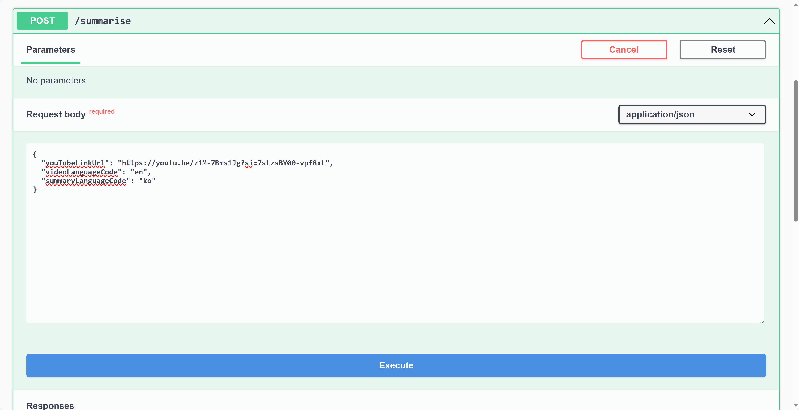
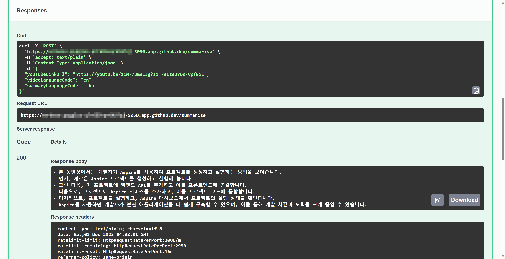
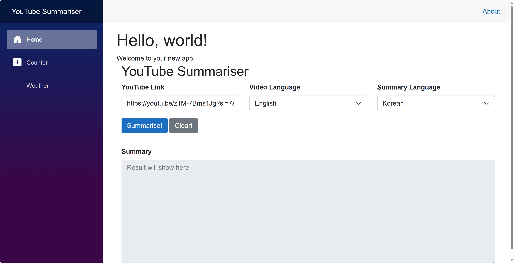
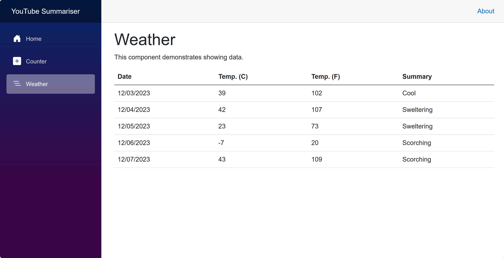

# 세션 02: ASP.NET Core 백엔드 API 앱 개발

이 세션에서는 [GitHub Copilot](https://docs.github.com/ko/copilot/overview-of-github-copilot/about-github-copilot-business) 기능을 활용해 빠르게 [ASP.NET Core 백엔드 API 앱](https://learn.microsoft.com/ko-kr/aspnet/core/fundamentals/apis?WT.mc_id=dotnet-121695-juyoo) 개발을 해 보겠습니다.

> [GitHub Codespaces](https://docs.github.com/ko/codespaces/overview) 또는 [Visual Studio Code](https://code.visualstudio.com/?WT.mc_id=dotnet-121695-juyoo) 환경에서 작업하는 것을 기준으로 합니다.


## 02-1: Web API 프로젝트 생성하기

1. 터미널을 열고 아래 명령어를 차례로 실행시켜 리포지토리의 루트 디렉토리로 이동합니다.

    ```bash
    # GitHub Codespaces
    REPOSITORY_ROOT=$CODESPACE_VSCODE_FOLDER
    cd $REPOSITORY_ROOT

    # bash/zsh
    REPOSITORY_ROOT=$(git rev-parse --show-toplevel)
    cd $REPOSITORY_ROOT

    # PowerShell
    $REPOSITORY_ROOT = git rev-parse --show-toplevel
    cd $REPOSITORY_ROOT
    ```

> 세이브 포인트에서 가져온 프로젝트를 사용하려면 아래 명령어를 차례로 실행시켜 프로젝트를 복원합니다.
> 
> ```bash
> # bash/zsh
> mkdir -p workshop && cp -a save-points/session-01/. workshop/
> cd workshop
> dotnet restore && dotnet build
> 
> # PowerShell
> New-Item -Type Directory -Path workshop -Force && Copy-Item -Path ./save-points/session-01/* -Destination ./workshop -Recurse -Force
> cd workshop
> dotnet restore && dotnet build
> ```

1. 아래 명령어를 차례로 실행시켜 ASP.NET Core Web API 앱 프로젝트를 생성합니다.

    ```bash
    cd $REPOSITORY_ROOT/workshop
    dotnet new webapi -n AspireYouTubeSummariser.ApiApp
    dotnet sln add AspireYouTubeSummariser.ApiApp
    ```

1. 아래 명령어를 차례로 실행시켜 ASP.NET Core Web API 앱 프로젝트를 빌드하고 실행시킵니다.

    ```bash
    dotnet restore && dotnet build
    dotnet watch run --project AspireYouTubeSummariser.ApiApp
    ```

1. GitHub Codespaces를 사용할 경우, 브라우저에서 404 에러가 나는 것을 확인합니다.

    

1. `Program.cs` 파일을 열고 `app.UseHttpsRedirection();` 라인을 찾아 그 바로 아래에서 `CTRL`+`I` 키 또는 `CMD`+`I` 키를 눌러 GitHub Copilot Chat 창을 활성화 시킵니다.
1. 아래 프롬프트를 GitHub Copilot Chat에 입력합니다.

    ```text
    Add a minimal API logic with the following conditions:

    - It should redirect from "/" to "/swagger", when the app is running in development environment,
    - It should exclude this endpoint from the OpenAPI documentation.
    ```

   그러면 아래와 비슷한 코드를 자동으로 만들어 줄 것입니다. 아래 코드를 참고해서 `Program.cs` 파일을 수정합니다.

    ```csharp
    if (app.Environment.IsDevelopment())
    {
        app.MapGet("/", () => Results.Redirect("/swagger")).ExcludeFromDescription();
    }
    ```

1. 파일을 수정한 후 GitHub Codespaces 사용시 앞서 404 에러가 난 페이지를 새로고침해서 Swagger UI 화면이 나오는 것을 확인합니다. 또는 `http://localhost:5050` 주소로 접속해서 Swagger UI 화면이 나오는 것을 확인합니다. 여기서 `5050`은 임의의 포트번호입니다.

    

   > 만약 Swagger UI 화면이 나오지 않는다면, 앞서 터미널 창에서 실행한 `dotnet watch run --project AspireYouTubeSummariser.ApiApp` 명령어를 중지하고 다시 실행시킵니다.

1. 실행이 잘 되는 것을 확인하면 터미널 창에서 `CTRL`+`C` 키를 눌러 실행을 중지합니다.

## 02-2: Summary 엔드포인트 생성하기

1. `Program.cs` 파일을 열고 `app.MapGet("/weatherforecast", ...)` 메서드와 `app.Run();` 메서드 사이의 라인을 찾아 거기서 아래 프롬프트를 GitHub Copilot Chat에 입력합니다.

    ```text
    Add a minimal API logic with the following conditions:

    - It should be of the endpoint, "/summarise".
    - It should process the HTTP POST request.
    - It should accept the "SummaryRequest" object as a request body.
    - It should return a string of "hello world" as a response.
    - It should be named "GetSummary".
    - It should be documented in the OpenAPI documentation.
    ```

   그러면 아래와 비슷한 코드를 자동으로 만들어 줄 것입니다. 아래 코드를 참고해서 `Program.cs` 파일을 수정합니다.

    ```csharp
    app.MapPost("/summarise", ([FromBody] SummaryRequest req) =>
    {
        var summary = "Hello World!";
        return summary;
    })
    .WithName("GetSummary")
    .WithOpenApi();
    ```

   > 만약 네임스페이스 참조를 할 수 없다는 오류가 발생한다면 오류가 발생한 곳에 커서를 두고 `CTRL`+`.` 키 또는 `CMD`+`.` 키를 눌러 네임스페이스를 추가합니다.

1. `Program.cs` 파일의 맨 아랫 부분에 `SummaryRequest` 레코드를 생성합니다.

    ```csharp
    record SummaryRequest(string? YouTubeLinkUrl, string VideoLanguageCode, string? SummaryLanguageCode);
    ```

## 02-3: YouTubeSummariserService 생성하기

1. `Program.cs` 파일의 맨 아랫 부분에 `YouTubeSummariserService` 클래스를 생성합니다. GitHub Copilot Chat 창을 활성화 시킨 후 아래 프롬프트를 입력합니다.

    ```text
    Add a class of YouTubeSummariserService with the following conditions:

    - It should have a method, "SummariseAsync" with a parameter of SummaryRequest.
    - It should return a string.
    ```

   그러면 아래와 비슷한 코드를 자동으로 만들어 줄 것입니다. 아래 코드를 참고해서 `YouTubeSummariserService` 클래스를 수정합니다.

    ```csharp
    class YouTubeSummariserService
    {
        public async Task<string> SummariseAsync(SummaryRequest req)
        {
            string summary = "This is a summary of the YouTube video.";

            return await Task.FromResult(summary).ConfigureAwait(false);
        }
    }
    ```

1. `Program.cs` 파일에서 `var builder = WebApplication.CreateBuilder(args);` 라인을 찾아 바로 밑에 아래 코드를 추가합니다.

    ```csharp
    builder.Services.AddScoped<YouTubeSummariserService>();
    ```

1. 앞서 정의했던 `app.MapPost("/summarise", ...)` 메서드의 람다식을 아래와 같이 수정합니다.

    ```csharp
    app.MapPost("/summarise", async ([FromBody] SummaryRequest req, YouTubeSummariserService service) =>
    {
        var summary = await service.SummariseAsync(req);
        return summary;
    })
    .WithName("GetSummary")
    .WithOpenApi();
    ```

## 02-4: YouTubeSummariserService에 의존성 주입하기

1. YouTube 자막을 추출하고, Azure OpenAI 서비스를 이용해 요약하기 위해 아래와 같이 터미널에서 NuGet 패키지를 추가합니다.

    ```bash
    cd $REPOSITORY_ROOT/workshop/AspireYouTubeSummariser.ApiApp
    dotnet add package Aliencube.YouTubeSubtitlesExtractor
    dotnet add package Azure.AI.OpenAI --prerelease
    ```

1. `appsettings.Development.json` 파일을 열고 아래와 같이 Azure OpenAI 서비스의 `Endpoint`와 `ApiKey`, `DeploymentName` 값을 추가합니다. 이 값들은 이미 [세션 00: 개발 환경 설정](./00-setup.md)에서 받았습니다.

    ```json
    "OpenAI": {
      "Endpoint": "{{ Azure OpenAI Proxy Service Endpoint }}",
      "ApiKey": "{{ Azure OpenAI Proxy Service Access Code }}",
      "DeploymentName": "{{ Azure OpenAI Proxy Service Deployment Name }}"
    }
    ```

   > 만약 `DeploymentName` 값을 받지 못했다면, 진행자에게 문의하세요.

   > **중요**: `appsettings.json` 파일에 추가한 Azure OpenAI 서비스의 값들은 절대로 GitHub에 커밋하지 마세요. 대신 `appsettings.Development.json` 파일에 추가하세요. `.gitignore` 파일에 이미 `appsettings.Development.json` 파일에 대한 제외 옵션이 추가되어 있습니다.

1. `appsettings.json` 파일에 아래와 같이 프롬프트 설정을 추가합니다.

    ```json
    "Prompt": {
      "System": "You are the expert of summarising long contents. You are going to summarise the following YouTube video transcript in a given language code.",
      "MaxTokens": 3000,
      "Temperature": 0.7
    },
    ```

1. `Program.cs` 파일을 열고 `YouTubeSummariserService` 클래스에 생성자를 아래와 같이 추가합니다.

    ```csharp
    class YouTubeSummariserService(IYouTubeVideo youtube, AzureOpenAIClient openai, IConfiguration config)
    {
        private readonly IYouTubeVideo _youtube = youtube ?? throw new ArgumentNullException(nameof(youtube));
        private readonly AzureOpenAIClient _openai = openai ?? throw new ArgumentNullException(nameof(openai));
        private readonly IConfiguration _config = config ?? throw new ArgumentNullException(nameof(config));
    ```

   > 만약 네임스페이스 참조를 할 수 없다는 오류가 발생한다면 오류가 발생한 곳에 커서를 두고 `CTRL`+`.` 키 또는 `CMD`+`.` 키를 눌러 네임스페이스를 추가합니다.

1. `SummariseAsync` 메서드 안에서 YouTube 자막을 다운로드 받는 로직을 구현합니다. GitHub Copilot을 이용해 아래와 같이 수정합니다.

    ```text
    Download the YouTube video transcript with the following conditions:

    - It should use IYouTubeVideo instance to download the YouTube video transcript.
    - It should aggregate the YouTube video transcript into a single string.
    ```

   그러면 아래와 비슷한 코드가 생성되었을 것입니다. 아래 코드를 참고해서 `SummariseAsync` 메서드를 수정합니다.

    ```csharp
    public async Task<string> SummariseAsync(SummaryRequest req)
    {
        Subtitle subtitle = await this._youtube.ExtractSubtitleAsync(req.YouTubeLinkUrl, req.VideoLanguageCode).ConfigureAwait(false);
        string caption = subtitle.Content.Select(p => p.Text).Aggregate((a, b) => $"{a}\n{b}");
    ```

   > 만약 네임스페이스 참조를 할 수 없다는 오류가 발생한다면 오류가 발생한 곳에 커서를 두고 `CTRL`+`.` 키 또는 `CMD`+`.` 키를 눌러 네임스페이스를 추가합니다.

1. 이어 아래 내용을 `string caption ...` 바로 밑에 추가합니다.

    ```csharp
    public async Task<string> SummariseAsync(SummaryRequest req)
    {
        Subtitle subtitle = await this._youtube.ExtractSubtitleAsync(req.YouTubeLinkUrl, req.VideoLanguageCode).ConfigureAwait(false);
        string caption = subtitle.Content.Select(p => p.Text).Aggregate((a, b) => $"{a}\n{b}");

        // 추가
        var chat = this._openai.GetChatClient(this._config["OpenAI:DeploymentName"]);
    ```

1. 계속해서 `SummariseAsync` 메서드 안에서 자막 내용을 요약하는 로직을 구현합니다. GitHub Copilot을 이용해 아래와 같이 수정합니다.

    ```text
    Create a list of ChatMessage instances with the following conditions:

    - The list should have three messages with:
      - A SystemChatMessage with the value of "Prompt:System" in the configuration.
      - A SystemChatMessage with the value of "Here's the transcript. Summarise it in 5 bullet point items in the given language code of \"{req.SummaryLanguageCode}\".".
      - A UserChatMessage with the value of "caption".
    ```

   그러면 아래와 비슷한 코드가 생성되었을 것입니다. 아래 코드를 참고해서 `SummariseAsync` 메서드를 수정합니다.

    ```csharp
    public async Task<string> SummariseAsync(SummaryRequest req)
    {
        ...

        var messages = new List<ChatMessage>()
        {
            new SystemChatMessage(this._config["Prompt:System"]),
            new SystemChatMessage($"Here's the transcript. Summarise it in 5 bullet point items in the given language code of \"{req.SummaryLanguageCode}\"."),
            new UserChatMessage(caption),
        };
    }
    ```

1. 계속해서 `SummariseAsync` 메서드 안에서 자막 내용을 요약하는 로직을 구현합니다. GitHub Copilot을 이용해 아래와 같이 수정합니다.

    ```text
    Create a ChatCompletionsOptions instance with the following conditions:

    - It should have the "MaxTokens" property set to the value of "Prompt:MaxTokens" in the configuration.
    - It should have the "Temperature" property set to the value of "Prompt:Temperature" in the configuration.
    ```

   그러면 아래와 비슷한 코드가 생성되었을 것입니다. 아래 코드를 참고해서 `SummariseAsync` 메서드를 수정합니다.

    ```csharp
    public async Task<string> SummariseAsync(SummaryRequest req)
    {
        ...

        var options = new ChatCompletionOptions()
        {
            MaxTokens = int.TryParse(this._config["Prompt:MaxTokens"], out var maxTokens) ? maxTokens : 3000,
            Temperature = float.TryParse(this._config["Prompt:Temperature"], out var temperature) ? temperature : 0.7f,
        };
    }
    ```

   > 만약 네임스페이스 참조를 할 수 없다는 오류가 발생한다면 오류가 발생한 곳에 커서를 두고 `CTRL`+`.` 키 또는 `CMD`+`.` 키를 눌러 네임스페이스를 추가합니다.

   마지막으로 아래 내용을 `SummariseAsync` 메서드 마지막에 추가합니다.

    ```csharp
    public async Task<string> SummariseAsync(SummaryRequest req)
    {
        ...

        var response = await chat.CompleteChatAsync(messages, options).ConfigureAwait(false);
        var summary = response.Value.Content[0].Text;

        return summary;
    }
    ```

1. `Program.cs` 파일의 `var builder = WebApplication.CreateBuilder(args);` 라인을 찾아 바로 밑에 아래 코드를 추가합니다.

    ```csharp
    builder.Services.AddHttpClient<IYouTubeVideo, YouTubeVideo>();
    builder.Services.AddScoped<AzureOpenAIClient>(sp =>
    {
        var config = sp.GetRequiredService<IConfiguration>();
        var endpoint = new Uri(config["OpenAI:Endpoint"]);
        var credential = new AzureKeyCredential(config["OpenAI:ApiKey"]);
        var client = new AzureOpenAIClient(endpoint, credential);

        return client;
    });
    ```

   > 만약 네임스페이스 참조를 할 수 없다는 오류가 발생한다면 오류가 발생한 곳에 커서를 두고 `CTRL`+`.` 키 또는 `CMD`+`.` 키를 눌러 네임스페이스를 추가합니다.

## 02-5: ASP.NET Core 백엔드 API 앱 실행하기

1. Solution Explorer에서 `AspireYouTubeSummariser.ApiApp` 프로젝트를 선택하고 마우스 오른쪽 버튼을 눌러 디버깅 모드로 실행합니다.

   > 또는 아래 명령어를 차례로 실행시켜 앱을 실행합니다.
   > 
   > ```bash
   > cd $REPOSITORY_ROOT/workshop
   > dotnet watch run --project AspireYouTubeSummariser.ApiApp
   > ```

1. Swagger UI 화면에서 아래와 같이 `youTubeLinkUrl`, `videoLanguageCode`, `summaryLanguageCode` 값을 입력한 후 결과를 확인합니다.

    ```json
    {
      "youTubeLinkUrl": "https://youtu.be/NN4Zzp-vOrU",
      "videoLanguageCode": "en",
      "summaryLanguageCode": "ko"
    }
    ```

    

   > YouTube 링크는 무엇이든 상관 없습니다. 여기서는 [https://youtu.be/NN4Zzp-vOrU](https://youtu.be/NN4Zzp-vOrU) 링크를 사용합니다. 혹시나 토큰 길이 관련 에러가 나오는 경우에는 30분 이하의 짧은 동영상을 사용해 보세요.

1. 그러면 아래와 같이 요약 결과가 나오는 것을 확인합니다.

    

1. 디버깅 모드를 중지합니다. 또는 앞서 터미널 창에서 실행시켰을 경우 `CTRL`+`C` 키를 눌러 실행을 중지합니다.

## 02-6: Blazor 프론트엔드 앱과 ASP.NET Core 백엔드 API 앱 통합하기

1. `AspireYouTubeSummariser.WebApp` 프로젝트의 `Clients` 디렉토리 아래 `ApiAppClient.cs` 파일을 열고 아래 메서드를 추가합니다.

    ```csharp
    public async Task<List<WeatherForecast>> WeatherForecastAsync()
    {
        using var response = await _http.GetAsync("weatherforecast").ConfigureAwait(false);

        var forecasts = await response.Content.ReadFromJsonAsync<List<WeatherForecast>>().ConfigureAwait(false);
        return forecasts ?? [];
    }
    ```

1. `ApiAppClient` 클래스 안에 아래와 같이 서브클래스를 추가합니다.

    ```csharp
    public class WeatherForecast
    {
        public DateOnly Date { get; set; }
        public int TemperatureC { get; set; }
        public string? Summary { get; set; }
        public int TemperatureF => 32 + (int)(TemperatureC / 0.5556);
    }
    ```

1. `IApiAppClient` 인터페이스도 아래와 같이 수정합니다.

    ```csharp
    public interface IApiAppClient
    {
        Task<List<ApiAppClient.WeatherForecast>> WeatherForecastAsync();
        Task<string> SummariseAsync(string youTubeLinkUrl, string videoLanguageCode, string summaryLanguageCode);
    }
    ```

1. `Components/Pages` 디렉토리 안의 `Weather.razor` 파일을 열고 `@page "/weather"` 바로 밑에 아래 내용을 추가합니다.

    ```razor
    @page "/weather"

    // 추가
    @inject IApiAppClient ApiApp
    ```

1. 그리고 `@code { ... }` 블록을 아래와 같이 수정합니다.

    ```razor
    @code {
        private List<ApiAppClient.WeatherForecast>? forecasts;

        protected override async Task OnInitializedAsync()
        {
            forecasts = await ApiApp.WeatherForecastAsync();
        }
    }
    ```

   > 만약 네임스페이스 참조를 할 수 없다는 오류가 발생한다면 오류가 발생한 곳에 커서를 두고 `CTRL`+`.` 키 또는 `CMD`+`.` 키를 눌러 네임스페이스를 추가합니다.

1. 터미널에서 아래 명령어를 실행시켜 ASP.NET Core 백엔드 API 앱을 실행시킵니다.

    ```bash
    cd $REPOSITORY_ROOT/workshop
    dotnet watch run --project AspireYouTubeSummariser.ApiApp
    ```

1. Solution Explorer에서 `AspireYouTubeSummariser.WebApp` 프로젝트를 선택하고 마우스 오른쪽 버튼을 눌러 디버깅 모드로 실행합니다.

   > 또는 또 다른 터미널 창을 열어 아래 명령어를 차례로 실행시켜 앱을 실행합니다.
   > 
   > ```bash
   > # GitHub Codespaces
   > REPOSITORY_ROOT=$CODESPACE_VSCODE_FOLDER
   > cd $REPOSITORY_ROOT/workshop
   > dotnet watch run --project AspireYouTubeSummariser.WebApp
   >
   > # bash/zsh
   > REPOSITORY_ROOT=$(git rev-parse --show-toplevel)
   > cd $REPOSITORY_ROOT/workshop
   > dotnet watch run --project AspireYouTubeSummariser.WebApp
   >
   > # PowerShell
   > $REPOSITORY_ROOT = git rev-parse --show-toplevel
   > cd $REPOSITORY_ROOT/workshop
   > dotnet watch run --project AspireYouTubeSummariser.WebApp
   > ```

1. 첫 화면에서 아래와 같이 **YouTube Link**를 입력합니다. 그리고 **Video Language**는 *English*, **Summary Language**는 *Korean*을 선택하고 `Summarise!` 버튼을 클릭합니다.

    

   > YouTube 링크는 무엇이든 상관 없습니다. 여기서는 [https://youtu.be/NN4Zzp-vOrU](https://youtu.be/NN4Zzp-vOrU) 링크를 사용합니다. 혹시나 토큰 길이 관련 에러가 나오는 경우에는 30분 이하의 짧은 동영상을 사용해 보세요.

1. 잠시 기다려서 아래와 같이 요약 메시지가 나오는 것을 확인합니다.

    

1. `Weather` 페이지로 이동해서 아래와 같이 날씨 정보가 나오는 것을 확인합니다.

    

1. 디버깅 모드를 중지합니다. 또는 터미널 창에서 웹 앱을 실행시켰을 경우 `CTRL`+`C` 키를 눌러 실행을 중지합니다.
1. 터미널 창에서 `CTRL`+`C` 키를 눌러 백엔드 API 앱 실행을 중지합니다.

---

축하합니다! ASP.NET Core 백엔드 API 앱 개발이 끝났습니다. 이제 [Session 03: Aspire 통합](./03-aspire-integration.md)으로 넘어가세요.
