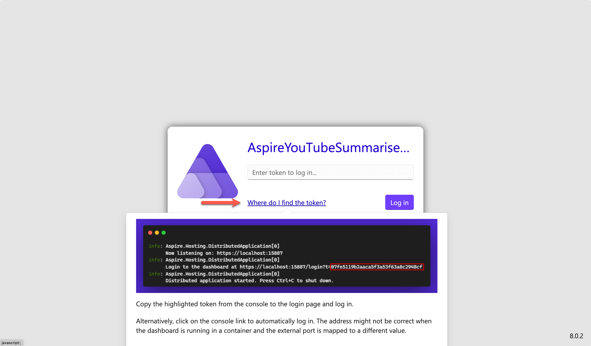
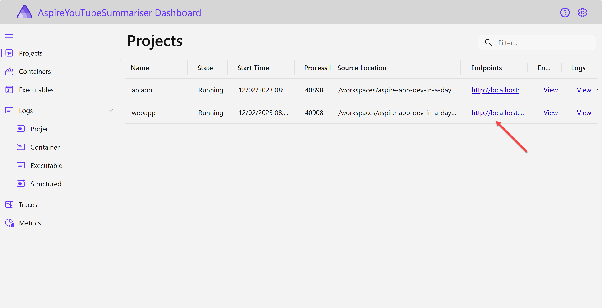
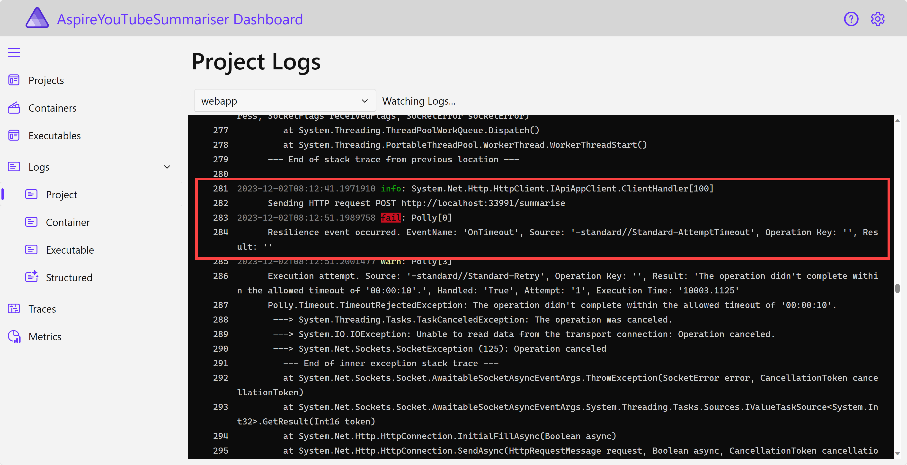

# 세션 03: Aspire 통합

이 세션에서는 [.NET Aspire](https://learn.microsoft.com/ko-kr/dotnet/aspire/get-started/aspire-overview?WT.mc_id=dotnet-121695-juyoo)를 활용해 [Blazor 프론트엔드 웹 앱](https://learn.microsoft.com/ko-kr/aspnet/core/blazor?WT.mc_id=dotnet-121695-juyoo)과 [ASP.NET Core 백엔드 API 앱](https://learn.microsoft.com/ko-kr/aspnet/core/fundamentals/apis?WT.mc_id=dotnet-121695-juyoo)을 Cloud-Native 방식으로 통합해 보겠습니다.

> [GitHub Codespaces](https://docs.github.com/ko/codespaces/overview) 또는 [Visual Studio Code](https://code.visualstudio.com/?WT.mc_id=dotnet-121695-juyoo) 환경에서 작업하는 것을 기준으로 합니다.


## 03-1: Aspire 프로젝트 생성하기

1. 터미널을 열고 아래 명령어를 차례로 실행시켜 Aspire 워크로드를 설치합니다.

    ```bash
    # zsh/bash
    sudo dotnet workload install aspire
    sudo dotnet workload update --from-previous-sdk
    
    # PowerShell
    dotnet workload install aspire
    dotnet workload update --from-previous-sdk
    ```

1. 아래 명령어를 차례로 실행시켜 Aspire 프로젝트를 생성합니다.

    ```bash
    # GitHub Codespaces
    REPOSITORY_ROOT=$CODESPACE_VSCODE_FOLDER
    cd $REPOSITORY_ROOT
    dotnet new aspire -n AspireYouTubeSummariser

    # bash/zsh
    REPOSITORY_ROOT=$(git rev-parse --show-toplevel)
    cd $REPOSITORY_ROOT
    dotnet new aspire -n AspireYouTubeSummariser

    # PowerShell
    $REPOSITORY_ROOT = git rev-parse --show-toplevel
    cd $REPOSITORY_ROOT
    dotnet new aspire -n AspireYouTubeSummariser
    ```

1. 아래 명령어를 통해 Aspire 디렉토리 이름을 `workshop`으로 변경합니다.

    ```bash
    # bash/zsh
    mv AspireYouTubeSummariser workshop

    # PowerShell
    Rename-Item -Path AspireYouTubeSummariser -NewName workshop -Force
    ```

1. 세이브 포인트에서 가져온 프로젝트를 복원합니다.

    ```bash
    # bash/zsh
    cd $REPOSITORY_ROOT
    mkdir -p workshop && cp -a save-points/session-02/. workshop/

    # PowerShell
    cd $REPOSITORY_ROOT
    New-Item -Type Directory -Path workshop -Force && Copy-Item -Path ./save-points/session-02/* -Destination ./workshop -Recurse -Force
    ```

1. 아래 명령어를 차례로 실행시켜 Aspire 프로젝트를 다시 연결합니다.

    ```bash
    cd $REPOSITORY_ROOT/workshop
    dotnet sln add AspireYouTubeSummariser.AppHost
    dotnet sln add AspireYouTubeSummariser.ServiceDefaults
    dotnet restore && dotnet build
    ```

1. `AspireYouTubeSummariser.ApiApp` 프로젝트에 `appsettings.Development.json` 파일을 열어 [세션 02: ASP.NET Core 백엔드 API 앱 개발](./02-aspnet-core-backend.md)에서 등록한 OpenAI 정보를 다시 입력합니다.

    ```json
    "OpenAI": {
      "Endpoint": "{{ Azure OpenAI Proxy Service Endpoint }}",
      "ApiKey": "{{ Azure OpenAI Proxy Service Access Code }}",
      "DeploymentName": "{{ Azure OpenAI Proxy Service Deployment Name }}"
    }
    ```

   > **중요**: `appsettings.json` 파일에 추가한 Azure OpenAI 서비스의 값들은 절대로 GitHub에 커밋하지 마세요. 대신 `appsettings.Development.json` 파일에 추가하세요. `.gitignore` 파일에 이미 `appsettings.Development.json` 파일에 대한 제외 옵션이 추가되어 있습니다.

## 03-2: Aspire 프로젝트에 기존 애플리케이션 통합하기

1. 아래 명령어를 차례로 실행시켜 `AspireYouTubeSummariser.AppHost` 프로젝트에 Blazor 프론트엔드 웹 앱과 ASP.NET Core 백엔드 API 앱을 추가합니다.

    ```bash
    cd $REPOSITORY_ROOT/workshop/AspireYouTubeSummariser.AppHost
    dotnet add reference ../AspireYouTubeSummariser.WebApp/
    dotnet add reference ../AspireYouTubeSummariser.ApiApp/
    ```

1. `AspireYouTubeSummariser.AppHost` 프로젝트의 `Program.cs` 파일을 열고 `var builder = DistributedApplication.CreateBuilder(args);` 바로 밑에 아래 코드를 추가합니다.

    ```csharp
    var apiapp = builder.AddProject<Projects.AspireYouTubeSummariser_ApiApp>("apiapp");

    builder.AddProject<Projects.AspireYouTubeSummariser_WebApp>("webapp")
           .WithReference(apiapp);
    ```

1. 아래 명령어를 차례로 실행시켜 `AspireYouTubeSummariser.WebApp` 프로젝트에 `AspireYouTubeSummariser.ServiceDefaults` 프로젝트를 추가합니다.

    ```bash
    cd $REPOSITORY_ROOT/workshop/AspireYouTubeSummariser.WebApp
    dotnet add reference ../AspireYouTubeSummariser.ServiceDefaults/
    ```

1. 아래 명령어를 차례로 실행시켜 `AspireYouTubeSummariser.ApiApp` 프로젝트에 `AspireYouTubeSummariser.ServiceDefaults` 프로젝트를 추가합니다.

    ```bash
    cd $REPOSITORY_ROOT/workshop/AspireYouTubeSummariser.ApiApp
    dotnet add reference ../AspireYouTubeSummariser.ServiceDefaults/
    ```

1. `AspireYouTubeSummariser.WebApp` 프로젝트의 `Program.cs` 파일을 열고 아래 라인을 수정합니다.

    ```csharp
    // 수정 전
    builder.Services.AddHttpClient<IApiAppClient, ApiAppClient>(p => p.BaseAddress = new Uri("http://localhost:5050"));

    // 수정 후
    builder.Services.AddHttpClient<IApiAppClient, ApiAppClient>(p => p.BaseAddress = new Uri("https+http://apiapp"));
    ```

1. `AspireYouTubeSummariser.WebApp` 프로젝트의 `Program.cs` 파일에 아래 두 라인을 추가합니다.

    ```csharp
    var builder = WebApplication.CreateBuilder(args);

    // 추가
    builder.AddServiceDefaults();

    ...

    var app = builder.Build();

    // 추가
    app.MapDefaultEndpoints();
    ```

1. `AspireYouTubeSummariser.ApiApp` 프로젝트의 `Program.cs` 파일에 아래 두 라인을 추가합니다.

    ```csharp
    var builder = WebApplication.CreateBuilder(args);

    // 추가
    builder.AddServiceDefaults();

    ...

    var app = builder.Build();

    // 추가
    app.MapDefaultEndpoints();
    ```

1. `AspireYouTubeSummariser.ApiApp` 프로젝트의 `Program.cs` 파일에서 `YouTubeSummariserService` 클래스의 `SummariseAsync` 메서드를 찾아 아래와 같이 의도적으로 30초의 지연을 추가합니다.

    ```csharp
    public async Task<string> SummariseAsync(SummaryRequest req)
    {
        Thread.Sleep(30000);

        ...
    ```

## 03-3: Aspire 프로젝트 빌드 및 실행하기

1. Solution Explorer에서 `AspireYouTubeSummariser.AppHost` 프로젝트를 선택하고 마우스 오른쪽 버튼을 눌러 디버깅 모드로 실행합니다.

   > 또는 아래 명령어를 차례로 실행시켜 앱을 실행합니다.
   > 
   > ```bash
   > cd $REPOSITORY_ROOT/workshop
   > dotnet watch run --project AspireYouTubeSummariser.AppHost
   > ```

<!-- 1. Ports 탭에서 `18888`` 포트를 선택해서 대시보드 앱을 실행시킵니다.

     -->

1. 아래와 같은 화면이 나타난다면 `Where do I find the token?` 링크를 클릭해서 안내를 따라 토큰값을 복사해 넣고 로그인합니다.

    

1. 대시보드 앱에서 `webapp`의 엔드포인트에 있는 링크를 클릭합니다.

    

   > GitHub Codespaces의 경우:
   > 
   > 1. 404 에러가 나타나는 것을 확인합니다.
   > 1. 대시보드 앱의 URL을 복사한 후 새 탭에서 열고 URL의 숫자(예: `17015`) 부분을 웹 앱의 포트번호(예: `5000`)로 변경한 후 접속합니다.

1. Blazor 프론트엔드 웹 앱이 잘 작동하는 것을 확인합니다.
1. `Weather` 페이지에서 데이터가 잘 나오는 것을 확인합니다.

    

1. 다시 홈페이지로 돌아와서 YouTube 링크를 입력하고 `Summarise` 버튼을 클릭합니다.

    

   > YouTube 링크는 무엇이든 상관 없습니다. 여기서는 [https://youtu.be/NN4Zzp-vOrU](https://youtu.be/NN4Zzp-vOrU) 링크를 사용합니다. 혹시나 토큰 길이 관련 에러가 나오는 경우에는 30분 이하의 짧은 동영상을 사용해 보세요.

1. 요약 결과가 나오지 않는 것을 확인합니다.
1. 다시 대시보드 페이지로 가서 로그를 확인합니다. 타임아웃이 발생했습니다.

    

   이는 Aspire에서 기본값으로 제공하는 회복탄력성 설정 때문에 발생한 것입니다. 이 설정을 수정해 보겠습니다.

1. 디버깅 모드를 중지합니다. 또는 앞서 터미널 창에서 실행시켰을 경우 `CTRL`+`C` 키를 눌러 실행을 중지합니다.

## 03-4: Aspire 프로젝트 회복탄력성 설정 수정하기

1. `AspireYouTubeSummariser.ServiceDefaults` 프로젝트의 `Extensions.cs` 파일을 열고 아래 라인을 수정합니다.

    ```csharp
    // 수정 전 - 기본 타임아웃 설정값은 10초
    http.AddStandardResilienceHandler();

    // 수정 후 - 타임아웃 설정값을 60초로 변경
    http.AddResilienceHandler("custom", builder =>
    {
        // See: https://www.pollydocs.org/strategies/retry.html
        builder.AddRetry(new HttpRetryStrategyOptions
        {
            // Customize and configure the retry logic.
            BackoffType = DelayBackoffType.Exponential,
            MaxRetryAttempts = 5,
            UseJitter = true
        });

        // See: https://www.pollydocs.org/strategies/circuit-breaker.html
        builder.AddCircuitBreaker(new HttpCircuitBreakerStrategyOptions
        {
            // Customize and configure the circuit breaker logic.
            SamplingDuration = TimeSpan.FromSeconds(10),
            FailureRatio = 0.2,
            MinimumThroughput = 3,
            ShouldHandle = static args =>
            {
                return ValueTask.FromResult(args is
                {
                    Outcome.Result.StatusCode:
                        HttpStatusCode.RequestTimeout or
                            HttpStatusCode.TooManyRequests
                });
            }
        });

        // See: https://www.pollydocs.org/strategies/timeout.html
        builder.AddTimeout(TimeSpan.FromSeconds(60));
    });
    ```

   > 만약 네임스페이스 참조를 할 수 없다는 오류가 발생한다면 오류가 발생한 곳에 커서를 두고 `CTRL`+`.` 키 또는 `CMD`+`.` 키를 눌러 네임스페이스를 추가합니다.

1. 다시 Solution Explorer에서 `AspireYouTubeSummariser.AppHost` 프로젝트를 선택하고 마우스 오른쪽 버튼을 눌러 디버깅 모드로 실행합니다.

   > 또는 아래 명령어를 차례로 실행시켜 앱을 실행합니다.
   > 
   > ```bash
   > cd $REPOSITORY_ROOT/workshop
   > dotnet watch run --project AspireYouTubeSummariser.AppHost
   > ```

1. 앞서와 같이 대시보드 페이지를 열고 Blazor 프론트엔드 웹 앱을 실행시킵니다.
1. 홈페이지에서 YouTube 링크를 입력하고 `Summarise` 버튼을 클릭합니다.

    

   > YouTube 링크는 무엇이든 상관 없습니다. 여기서는 [https://youtu.be/NN4Zzp-vOrU](https://youtu.be/NN4Zzp-vOrU) 링크를 사용합니다. 혹시나 토큰 길이 관련 에러가 나오는 경우에는 30분 이하의 짧은 동영상을 사용해 보세요.

1. 요약 결과가 잘 나오는 것을 확인합니다.

    

1. 디버깅 모드를 중지합니다. 또는 앞서 터미널 창에서 실행시켰을 경우 `CTRL`+`C` 키를 눌러 실행을 중지합니다.

1. 앞서 `AspireYouTubeSummariser.ApiApp` 프로젝트의 `Program.cs` 파일에서 `YouTubeSummariserService` 클래스의 `SummariseAsync` 메서드에 의도적으로 추가했던 30초 지연을 아래와 같이 주석처리하거나 삭제합니다.

    ```csharp
    public async Task<string> SummariseAsync(SummaryRequest req)
    {
        // Thread.Sleep(30000);

        ...
    ```

## 03-5: Blazor 프론트엔드 웹 앱에 Redis Cache 적용하기

1. 아래와 같이 터미널에서 NuGet 패키지를 추가합니다.

    ```bash
    cd $REPOSITORY_ROOT/workshop/AspireYouTubeSummariser.AppHost
    dotnet add package Aspire.Hosting.Redis
    ```

1. `AspireYouTubeSummariser.AppHost` 프로젝트의 `Program.cs` 파일을 열고 아래와 같이 수정합니다.

    ```csharp
    var builder = DistributedApplication.CreateBuilder(args);

    // 추가
    var cache = builder.AddRedis("cache");

    ...

    // WithReference 추가
    builder.AddProject<Projects.AspireYouTubeSummariser_WebApp>("webapp")
       .WithReference(cache)
       .WithReference(apiapp);
    ```

1. 아래와 같이 터미널에서 NuGet 패키지를 추가합니다.

    ```bash
    cd $REPOSITORY_ROOT/workshop/AspireYouTubeSummariser.WebApp
    dotnet add package Aspire.StackExchange.Redis.OutputCaching
    ```

1. `AspireYouTubeSummariser.WebApp` 프로젝트의 `Program.cs` 파일에 아래 두 라인을 추가합니다.

    ```csharp
    var builder = WebApplication.CreateBuilder(args);
    builder.AddServiceDefaults();

    // 추가
    builder.AddRedisOutputCache("cache");

    ...

    var app = builder.Build();
    app.MapDefaultEndpoints();

    // 추가
    app.UseOutputCache();
    ```

1. `AspireYouTubeSummariser.WebApp` 프로젝트의 `Components/Pages/Weather.razor` 파일을 아래와 같이 수정합니다.

    ```razor
    @page "/weather"
    @using AspireYouTubeSummariser.WebApp.Clients

    @* 추가 *@
    @attribute [StreamRendering(true)]
    @attribute [OutputCache(Duration = 5)]
    @* 추가 *@

    @inject IApiAppClient ApiApp
    ```

   > 만약 네임스페이스 참조를 할 수 없다는 오류가 발생한다면 오류가 발생한 곳에 커서를 두고 `CTRL`+`.` 키 또는 `CMD`+`.` 키를 눌러 네임스페이스를 추가합니다.

1. Solution Explorer에서 `AspireYouTubeSummariser.AppHost` 프로젝트를 선택하고 마우스 오른쪽 버튼을 눌러 디버깅 모드로 실행합니다.

   > 또는 아래 명령어를 차례로 실행시켜 앱을 실행합니다.
   > 
   > ```bash
   > cd $REPOSITORY_ROOT/workshop
   > dotnet watch run --project AspireYouTubeSummariser.AppHost
   > ```

1. 앞서와 같이 대시보드 페이지를 열고 Blazor 프론트엔드 웹 앱을 실행시킵니다.
1. `Weather` 페이지로 이동해서 계속 새로고침해 보면서 동일한 데이터가 5초간 유지되는 것을 확인합니다.
1. 디버깅 모드를 중지합니다. 또는 앞서 터미널 창에서 실행시켰을 경우 `CTRL`+`C` 키를 눌러 실행을 중지합니다.

## 03-6: ASP.NET Core 백엔드 API 앱의 Azure OpenAI 설정을 AppHost로 이전하기

1. `AspireYouTubeSummariser.ApiApp` 프로젝트의 `appsettings.Development.json` 파일에 있는 `OpenAI` 설정을 삭제하고 이를 `AspireYouTubeSummariser.AppHost` 프로젝트의 `appsettings.Development.json` 파일에 추가합니다.

   > **중요**: `appsettings.json` 파일에 추가한 Azure OpenAI 서비스의 값들은 절대로 GitHub에 커밋하지 마세요. 대신 `appsettings.Development.json` 또는  `appsettings.Production.json` 파일에 추가하세요. `.gitignore` 파일에 이미 `appsettings.Development.json`과 `appsettings.Production.json` 파일에 대한 제외 옵션이 추가되어 있습니다.

1. `AspireYouTubeSummariser.AppHost` 프로젝트의 `Program.cs` 파일을 열고 아래와 같이 수정합니다.

    ```csharp
    var builder = DistributedApplication.CreateBuilder(args);
    var cache = builder.AddRedisContainer("cache");

    // 추가
    var config = builder.Configuration;

    // 수정
    var apiapp = builder.AddProject<Projects.AspireYouTubeSummariser_ApiApp>("apiapp")
                        .WithEnvironment("OpenAI__Endpoint", config["OpenAI:Endpoint"])
                        .WithEnvironment("OpenAI__ApiKey", config["OpenAI:ApiKey"])
                        .WithEnvironment("OpenAI__DeploymentName", config["OpenAI:DeploymentName"]);
    ```

1. Solution Explorer에서 `AspireYouTubeSummariser.AppHost` 프로젝트를 선택하고 마우스 오른쪽 버튼을 눌러 디버깅 모드로 실행합니다.

   > 또는 아래 명령어를 차례로 실행시켜 앱을 실행합니다.
   > 
   > ```bash
   > cd $REPOSITORY_ROOT/workshop
   > dotnet watch run --project AspireYouTubeSummariser.AppHost
   > ```

1. 앞서와 같이 대시보드 페이지를 열고 Blazor 프론트엔드 웹 앱을 실행시킵니다.
1. 홈페이지에서 YouTube 링크를 입력하고 `Summarise` 버튼을 클릭합니다.

    

   > YouTube 링크는 무엇이든 상관 없습니다. 여기서는 [https://youtu.be/NN4Zzp-vOrU](https://youtu.be/NN4Zzp-vOrU) 링크를 사용합니다. 혹시나 토큰 길이 관련 에러가 나오는 경우에는 30분 이하의 짧은 동영상을 사용해 보세요.

1. 요약 결과가 잘 나오는 것을 확인합니다.

    

1. 디버깅 모드를 중지합니다. 또는 앞서 터미널 창에서 실행시켰을 경우 `CTRL`+`C` 키를 눌러 실행을 중지합니다.

---

축하합니다! Aspire 통합 작업이 끝났습니다. 이제 [Session 04: Azure 배포 &ndash; Azure Container Apps](./04-azure-deployment-aca.md)으로 넘어가세요.
