# 세션 04: Azure 배포 - Azure Container Apps

이 세션에서는 [.NET Aspire](https://learn.microsoft.com/ko-kr/dotnet/aspire/get-started/aspire-overview?WT.mc_id=dotnet-121695-juyoo)로 개발한 애플리케이션을 [Azure Developer CLI](https://learn.microsoft.com/ko-kr/azure/developer/azure-developer-cli/overview?WT.mc_id=dotnet-121695-juyoo)를 이용해 [Azure Container Apps](https://learn.microsoft.com/ko-kr/azure/container-apps/overview?WT.mc_id=dotnet-121695-juyoo)로 배포해 보겠습니다.

> [GitHub Codespaces](https://docs.github.com/ko/codespaces/overview) 또는 [Visual Studio Code](https://code.visualstudio.com/?WT.mc_id=dotnet-121695-juyoo) 환경에서 작업하는 것을 기준으로 합니다.

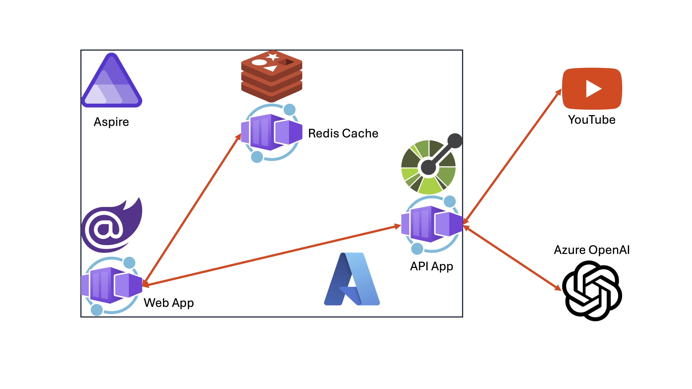

## 04-1: Azure Developer CLI, Azure CLI 및 GitHub CLI 로그인하기

1. **GitHub Codespaces**의 경우

   GitHub Codespaces 인스턴스 안에서 아래 명령어를 실행시켜 Azure 및 GitHub에 로그인합니다.

    ```bash
    # Azure Developer CLI login
    azd auth login --use-device-code=false

    # Azure CLI login
    az login

    # GitHub CLI login
    GITHUB_TOKEN=
    gh auth login
    ```

   > **중요**: 만약 `azd auth login --use-device-code false` 또는 `az login` 명령어 실행시 새 브라우저 탭이 뜨면서 404 에러가 날 경우, 주소창의 URL 값을 복사해서 새 zsh 터미널을 열고 `curl <복사한 URL>`을 해 줍니다.

1. **Visual Studio Code**의 경우

   먼저 아래 도구를 설치합니다.

   - [Azure Developer CLI](https://learn.microsoft.com/ko-kr/azure/developer/azure-developer-cli/overview?WT.mc_id=dotnet-121695-juyoo)
   - [Azure CLI](https://learn.microsoft.com/ko-kr/cli/azure/what-is-azure-cli?WT.mc_id=dotnet-121695-juyoo)
   - [GitHub CLI](https://cli.github.com/)

   Visual Studio Code에서 아래 명령어를 실행시켜 Azure 및 GitHub에 로그인합니다.

    ```bash
    # Azure Developer CLI login
    azd auth login

    # Azure CLI login
    az login

    # GitHub CLI login
    GITHUB_TOKEN=
    gh auth login
    ```

1. 로그인이 끝났다면 아래 명령어를 통해 제대로 로그인이 되어 있는지 확인합니다.

    ```bash
    # Azure Developer CLI
    azd auth login --check-status

    # Azure CLI
    az account show

    # GitHub CLI
    gh auth status
    ```

## 04-2: Aspire 프로젝트 준비하기

1. 터미널을 열고 아래 명령어를 차례로 실행시켜 리포지토리의 루트 디렉토리로 이동합니다.

    ```bash
    # GitHub Codespaces
    REPOSITORY_ROOT=$CODESPACE_VSCODE_FOLDER
    cd $REPOSITORY_ROOT

    # bash/zsh
    REPOSITORY_ROOT=$(git rev-parse --show-toplevel)
    cd $REPOSITORY_ROOT

    # PowerShell
    $REPOSITORY_ROOT = git rev-parse --show-toplevel
    cd $REPOSITORY_ROOT
    ```

> 세이브 포인트에서 가져온 프로젝트를 사용하려면 아래 명령어를 차례로 실행시켜 프로젝트를 복원합니다.
> 
> ```bash
> # bash/zsh
> mkdir -p workshop && cp -a save-points/session-03/. workshop/
> cd workshop
> dotnet restore && dotnet build
> 
> # PowerShell
> New-Item -Type Directory -Path workshop -Force && Copy-Item -Path ./save-points/session-03/* -Destination ./workshop -Recurse -Force
> cd workshop
> dotnet restore && dotnet build
> ```

1. `AspireYouTubeSummariser.AppHost` 프로젝트의 `appsettings.Development.json` 파일에 [세션 03: Aspire 통합](./03-aspire-integration.md)에서 등록한 OpenAI 정보를 다시 입력합니다.

    ```json
    "OpenAI": {
      "Endpoint": "{{ Azure OpenAI Proxy Service Endpoint }}",
      "ApiKey": "{{ Azure OpenAI Proxy Service Access Code }}",
      "DeploymentName": "{{ Azure OpenAI Proxy Service Deployment Name }}"
    }
    ```

   > **중요**: `appsettings.json` 파일에 추가한 Azure OpenAI 서비스의 값들은 절대로 GitHub에 커밋하지 마세요. 대신 `appsettings.Development.json` 파일에 추가하세요. `.gitignore` 파일에 이미 `appsettings.Development.json` 파일에 대한 제외 옵션이 추가되어 있습니다.

## 04-3: Azure Developer CLI로 배포 준비하기

1. 아래 명령어를 차례로 실행시켜 배포 환경을 준비합니다.

    ```bash
    # bash/zsh
    cd $REPOSITORY_ROOT/workshop
    AZURE_ENV_NAME="{{ GITHUB_ID }}"
    azd init -e $AZURE_ENV_NAME

    # PowerShell
    cd $REPOSITORY_ROOT/workshop
    $AZURE_ENV_NAME = "{{ GITHUB_ID }}"
    azd init -e $AZURE_ENV_NAME
    ```

   > **중요**: `{{ GITHUB_ID }}`는 자신의 GitHub 아이디로 변경해야 합니다. 예를 들어 GitHub 아이디가 `Azure-Samples`라면 `{{ GITHUB_ID }}`를 `Azure-Samples`로 변경하세요.

1. 배포 환경 초기화 방법을 물어보면 `Use code in the current directory` 옵션을 선택합니다.
1. Azure Container Apps를 사용해 배포한다고 물어봅니다. `Confirm and continue initializing my app` 옵션을 선택합니다.
1. 아래 그림과 같이 `workshop` 디렉토리 아래 `.azure` 디렉토리와 `next-step.md`, `azure.yaml` 파일이 생성되었습니다.

    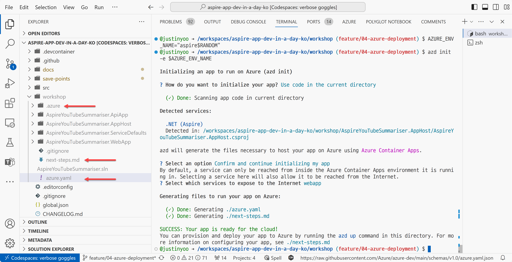

## 04-4: Azure Container Apps로 배포하기

1. 아래 명령어를 실행시켜 Aspire 앱을 Azure로 배포합니다.

    ```bash
    azd up
    ```

1. 어떤 Azure 구독을 사용할 것인지 물어봅니다. 사용할 구독을 선택합니다.
1. 어느 지역에 배포할 것인지 물어봅니다. 아무 지역이나 선택해도 되지만, 여기서는 `Korea Central`을 선택합니다.
1. 배포가 끝나고 나면 아래와 같은 화면이 나옵니다.

    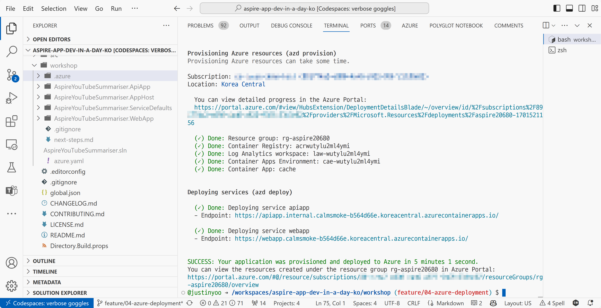

1. Azure Portal에 가서 아래와 같이 앱이 배포된 것을 확인합니다.

    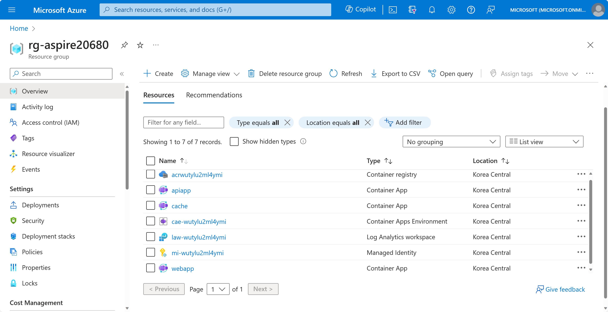

1. `cache` 컨테이너 앱을 클릭하고 `Overview` 블레이드에서 Application Url 값이 `cache.internal`로 시작하는 것을 확인합니다.
1. `apiapp` 컨테이너 앱을 클릭하고 `Overview` 블레이드에서 Application Url 값이 `https://apiapp.internal`로 시작하는 것을 확인한 후 링크를 클릭합니다. 앱이 존재하지 않는다고 나옵니다.

    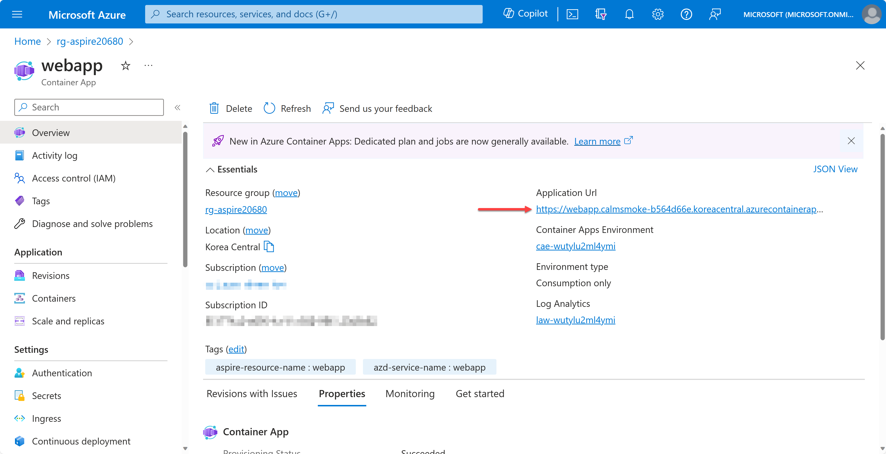

1. `apiapp` 컨테이너 앱의 `Containers` 블레이드에서 `Environment Variables` 탭 아래 `OpenAI__ApiKey`, `OpenAI__DeploymentName`, `OpenAI__Endpoint` 값이 제대로 설정되어 있는지 확인합니다.

    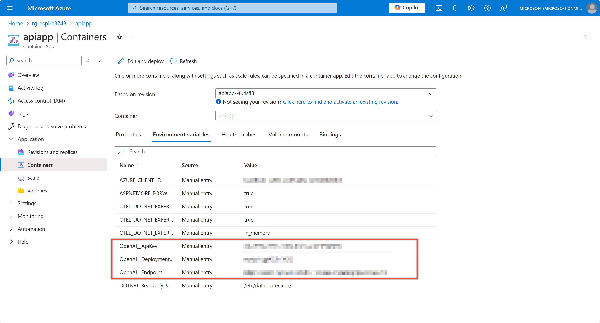

1. `webapp` 컨테이너 앱을 클릭하고 `Overview` 블레이드에서 Application Url 값이 `https://webapp.internal`로 시작하는 것을 확인한 후 링크를 클릭합니다. 앱이 존재하지 않는다고 나옵니다.

    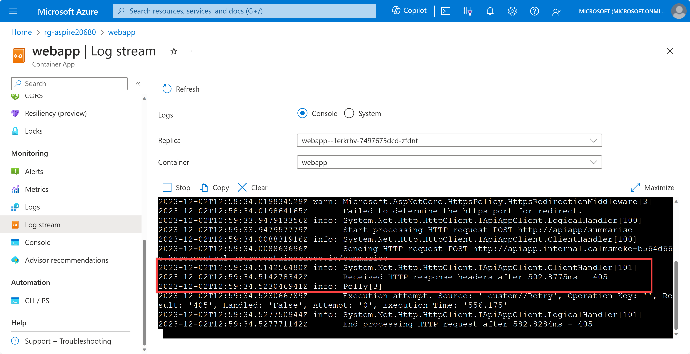

1. `webapp` 컨테이너 앱의 `Containers` 블레이드에서 `Environment Variables` 탭 아래 `services__apiapp__http__0`, `services__apiapp__https__0`, `ConnectionStrings__cache` 값이 제대로 설정되어 있는지 확인합니다.

    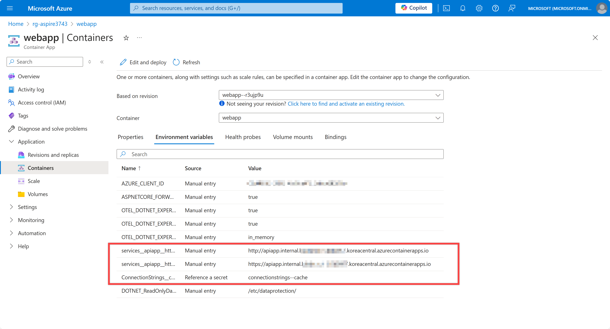

## 04-5: 프론트엔드 웹 앱 외부 접속 가능하게 하기

1. `AspireYouTubeSummariser.AppHost` 프로젝트의 `Program.cs` 파일을 열고 아래와 같이 수정합니다.

    ```csharp
    // 변경 전
    builder.AddProject<Projects.AspireYouTubeSummariser_WebApp>("webapp")
           .WithReference(cache)
           .WithReference(apiapp);
    
    // 변경 후
    builder.AddProject<Projects.AspireYouTubeSummariser_WebApp>("webapp")
           // 추가 👇
           .WithExternalHttpEndpoints()
           // 추가 👆
           .WithReference(cache)
           .WithReference(apiapp);
    ```

1. 아래 명령어를 실행시켜 앱을 다시 배포합니다.

    ```bash
    azd deploy
    ```

1. 배포가 끝난 후 Azure Portal에서 `webapp` 컨테이너 앱을 클릭하고 `Overview` 블레이드에서 Application Url 값이 `internal`이 빠지고 `https://webapp`로 시작하는 것을 확인한 후 링크를 클릭합니다. 정상적으로 앱이 나타납니다.

    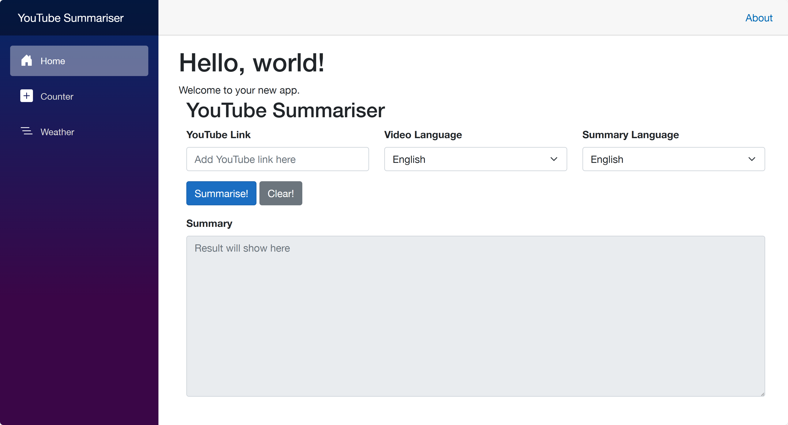

1. Azure Portal에서 `cae-`로 시작하는 Container Apps Environment를 클릭하고 `Overview` 블레이드에서 .NET Aspire Dashboard의 `Open dashboard` 링크가 보이는 것을 확인합니다.

    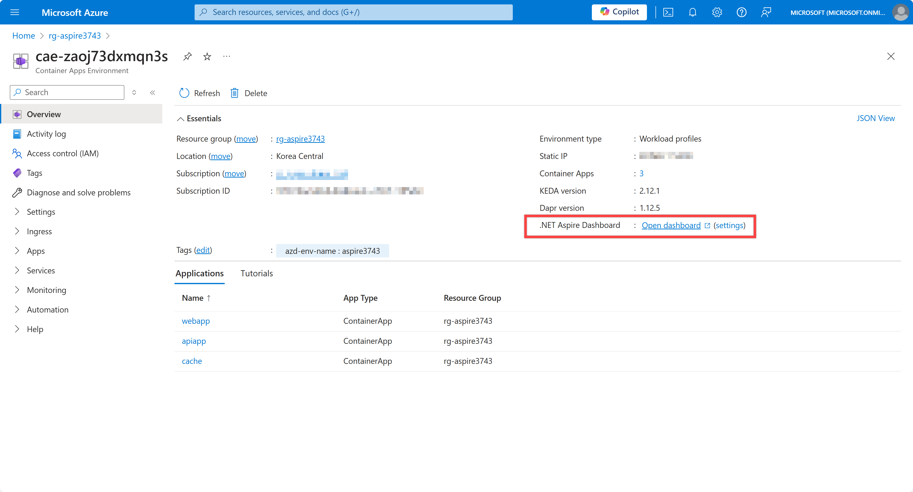

1. .NET Aspire Dashboard 링크를 클릭해서 아래와 같이 대시보드 화면이 보이는 것을 확인합니다.

    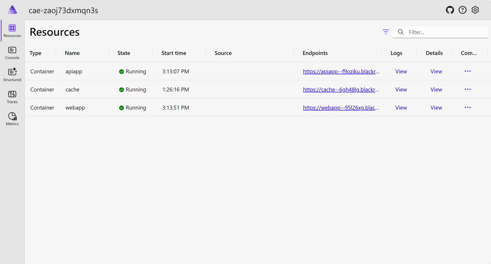

## 04-6: 배포된 앱 테스트하기

1. 홈페이지에서 YouTube 링크를 입력하고 `Summarise` 버튼을 클릭합니다.

    

   > YouTube 링크는 무엇이든 상관 없습니다. 여기서는 [https://youtu.be/NN4Zzp-vOrU](https://youtu.be/NN4Zzp-vOrU) 링크를 사용합니다. 혹시나 토큰 길이 관련 에러가 나오는 경우에는 30분 이하의 짧은 동영상을 사용해 보세요.

1. 요약 결과가 잘 나오는 것을 확인합니다.

    

## 04-7: GitHub Actions로 배포 자동화하기

1. 아래 명령어를 차례로 실행시켜 배포 자동화를 위한 준비를 합니다.

    ```bash
    cd $REPOSITORY_ROOT
    mkdir -p .github/workflows
    cd $REPOSITORY_ROOT/workshop
    ```

1. 아래 명령어를 실행시켜 GitHub Actions 워크플로우를 실행시킬 수 있는 환경을 설정합니다.

    ```bash
    azd pipeline config
    ```

1. 설정 마지막에 `Would you like to commit and push your local changes to start the configured CI pipeline?` 라는 질문이 나오면 `n`를 선택하고 종료합니다.
1. 아래 명령어를 실행시켜 GitHub Actions 워크플로우 실행에 필요한 secret 값을 설정합니다. 이 값은 이미 [세션 03: Aspire 통합](./03-aspire-integration.md)에서 설정한 값입니다.

    ```bash
    gh secret set AZURE_OPENAI_ENDPOINT --body "{{ Azure OpenAI Proxy Service Endpoint }}" --repo {{ GITHUB_ID }}/aspire-app-dev-in-a-day-ko
    gh secret set AZURE_OPENAI_API_KEY --body "{{ Azure OpenAI Proxy Service Access Code }}" --repo {{ GITHUB_ID }}/aspire-app-dev-in-a-day-ko
    gh secret set AZURE_OPENAI_DEPLOYMENT_NAME --body "{{ Azure OpenAI Proxy Service Deployment Name }}" --repo {{ GITHUB_ID }}/aspire-app-dev-in-a-day-ko
    ```

   > **NOTE**: `{{ GITHUB_ID }}`는 자신의 GitHub 아이디로 변경해야 합니다.

1. 아래 명령어를 실행시켜 GitHub Actions 워크플로우 파일을 생성합니다.

    ```bash
    # bash/zsh
    curl \
        https://raw.githubusercontent.com/Azure-Samples/azd-starter-bicep/main/.github/workflows/azure-dev.yml \
        --output $REPOSITORY_ROOT/.github/workflows/azure-dev.yml
    
    # PowerShell
    Invoke-WebRequest `
        -Uri https://raw.githubusercontent.com/Azure-Samples/azd-starter-bicep/main/.github/workflows/azure-dev.yml `
        -OutFile $REPOSITORY_ROOT/.github/workflows/azure-dev.yml
    ```

1. `.github/workflows` 디렉토리 아래의 `azre-dev.yml` 파일을 열고 아래와 같이 수정합니다. YAML 파일은 들여쓰기가 중요하므로 주의해서 수정하세요.

    ```yml
    on:
      workflow_dispatch:
      push:
        # Run when commits are pushed to mainline branch (main or master)
        # Set this to the mainline branch you are using
        branches:
          - main
          - master
    
        # 아래 두 줄 추가 👇
        paths:
          - 'workshop/**/*'
        # 위 두 줄 추가 👆
    ```

1. `azure-dev.yml` 파일의 `Checkout` 액션과 `Install azd` 다음에 아래 세 액션을 추가합니다. YAML 파일은 들여쓰기가 중요하므로 주의해서 수정하세요.

    ```yaml
    - name: Checkout
      uses: actions/checkout@v4
    
    # 아래 액션 추가 👇
    - name: Install .NET 8 SDK
      uses: actions/setup-dotnet@v4
      with:
        dotnet-version: 8.x
    
    - name: Install .NET Aspire workload
      run: dotnet workload install aspire

    - name: Update appsettings.json
      shell: pwsh
      run: |
        pushd ./workshop
        $appsettings = Get-Content -Path ./AspireYouTubeSummariser.AppHost/appsettings.json | ConvertFrom-Json
        $appsettings.OpenAI.Endpoint = "${{ secrets.AZURE_OPENAI_ENDPOINT }}"
        $appsettings.OpenAI.ApiKey = "${{ secrets.AZURE_OPENAI_API_KEY }}"
        $appsettings.OpenAI.DeploymentName = "${{ secrets.AZURE_OPENAI_DEPLOYMENT_NAME }}"
        $appsettings | ConvertTo-Json -Depth 100 | Out-File -FilePath ./AspireYouTubeSummariser.AppHost/appsettings.json -Encoding utf8 -Force
        popd
    # 위 액션 추가 👆
    
    - name: Install azd
      uses: Azure/setup-azd@v1.0.0
    ```

1. `azre-dev.yml` 파일의 맨 마지막 부분에 있는 액션을 아래와 같이 수정합니다. YAML 파일은 들여쓰기가 중요하므로 주의해서 수정하세요.

    ```yaml
    # 변경전
    - name: Provision Infrastructure
      run: azd provision --no-prompt
    
    - name: Deploy Application
      run: azd deploy --no-prompt
    
    # 변경후
    - name: Provision Infrastructure
      run: |
        pushd ./workshop
        azd provision --no-prompt
        popd
    
    - name: Deploy Application
      run: |
        pushd ./workshop
        azd deploy --no-prompt
        popd
    ```

1. 리포지토리 루트 디렉토리의 `.gitignore` 파일을 열고 맨 마지막으로 이동해서 아래와 같이 수정합니다.

    ```plaintext
    # 변경 전
    bundle.js.*.txt
    workshop*/
    z-demo*/
    
    # 변경 후
    bundle.js.*.txt
    # workshop*/
    z-demo*/
    ```

1. 아래 명령어를 실행시켜 변경 사항을 커밋하고 푸시합니다.

    ```bash
    git add .
    git commit -m "Add GitHub Actions workflow for Azure deployment"
    git push
    ```

1. GitHub 리포지토리의 Actions 탭에서 `Azure Dev` 워크플로우가 돌아가는 것을 확인합니다.

    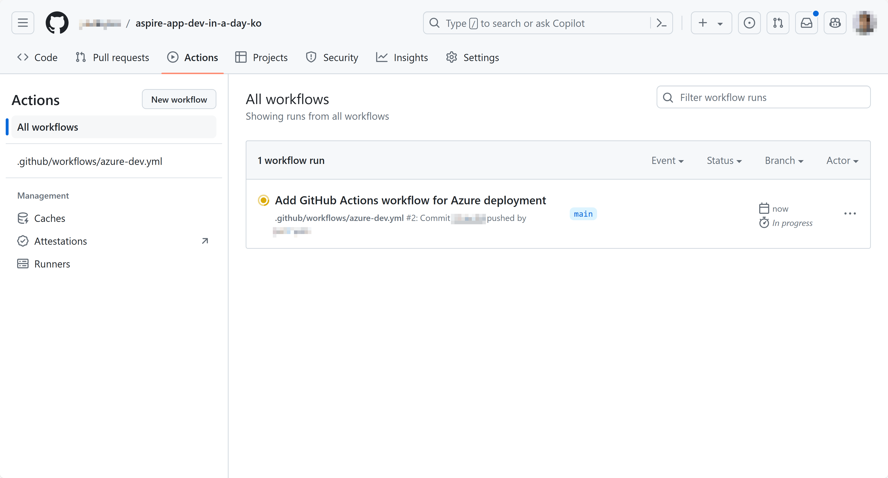

1. GitHub Actions 워크플로우가 성공적으로 끝나면 로그 화면에서 아래와 같은 링크를 볼 수 있습니다. 이를 클릭해서 정상적으로 작동하는지 확인합니다.

    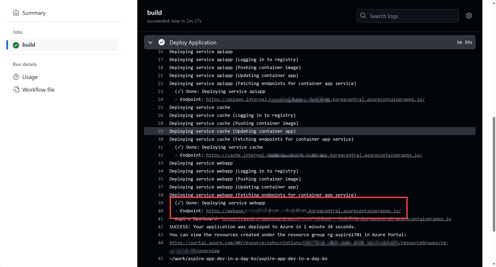

   > YouTube 링크는 무엇이든 상관 없습니다. 여기서는 [https://youtu.be/NN4Zzp-vOrU](https://youtu.be/NN4Zzp-vOrU) 링크를 사용합니다. 혹시나 토큰 길이 관련 에러가 나오는 경우에는 30분 이하의 짧은 동영상을 사용해 보세요.

## 04-8: 배포된 앱 삭제하기

1. 아래 명령어를 통해 배포한 앱을 삭제합니다.

    ```bash
    azd down --purge --force
    ```

---

축하합니다! Azure 배포 작업이 끝났습니다. 이제 [Session 05: Azure 배포 &ndash; Azure Kubernetes Service](./04-azure-deployment-aks.md)으로 넘어가세요.
