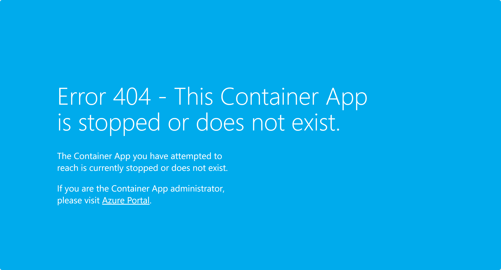

# 세션 04: Azure 배포 - Azure Container Apps

이 세션에서는 [.NET Aspire](https://learn.microsoft.com/ko-kr/dotnet/aspire/get-started/aspire-overview?WT.mc_id=dotnet-121695-juyoo)로 개발한 애플리케이션을 [Azure Developer CLI](https://learn.microsoft.com/ko-kr/azure/developer/azure-developer-cli/overview?WT.mc_id=dotnet-121695-juyoo)를 이용해 [Azure Container Apps](https://learn.microsoft.com/ko-kr/azure/container-apps/overview?WT.mc_id=dotnet-121695-juyoo)로 배포해 보겠습니다.

> [GitHub Codespaces](https://docs.github.com/ko/codespaces/overview) 환경에서 작업하는 것을 기준으로 진행합니다. 로컬 개발 환경의 [Visual Studio Code](https://code.visualstudio.com/?WT.mc_id=dotnet-121695-juyoo)를 사용할 경우 대부분 비슷하지만 살짝 다를 수 있습니다.


## 04-1: Azure Developer CLI, Azure CLI 및 GitHub CLI 로그인하기

1. GitHub Codespaces 인스턴스 안에서 아래 명령어를 실행시켜 Azure 및 GitHub에 로그인합니다.

    ```bash
    # Azure Developer CLI login
    azd auth login --use-device-code=false

    # Azure CLI login
    az login

    # GitHub CLI login
    GITHUB_TOKEN=
    gh auth login
    ```

   > **중요**: 만약 `azd auth login --use-device-code false` 또는 `az login` 명령어 실행시 새 브라우저 탭이 뜨면서 404 에러가 날 경우, 주소창의 URL 값을 복사해서 새 zsh 터미널을 열고 `curl <복사한 URL>`을 해 줍니다.

1. 로그인이 끝났다면 아래 명령어를 통해 제대로 로그인이 되어 있는지 확인합니다.

    ```bash
    # Azure Developer CLI
    azd auth login --check-status

    # Azure CLI
    az account show

    # GitHub CLI
    gh auth status
    ```

## 04-2: Aspire 프로젝트 준비하기

1. 아래 명령어를 차례로 실행시켜 Aspire 프로젝트를 복원합니다.

    ```bash
    cd $CODESPACE_VSCODE_FOLDER
    mkdir -p workshop && cp -a save-points/session-03/. workshop/
    cd workshop
    dotnet restore && dotnet build
    ```

1. `AspireYouTubeSummariser.AppHost` 프로젝트에 `appsettings.json` 파일을 3장에서 등록한 OpenAI 정보를 다시 입력합니다.

    ```json
    "OpenAI": {
      "Endpoint": "{{ Azure OpenAI Proxy Service Endpoint }}",
      "ApiKey": "{{ Azure OpenAI Proxy Service Access Code }}",
      "DeploymentName": "{{ Azure OpenAI Proxy Service Deployment Name }}"
    }
    ```

   > **중요**: `appsettings.json` 파일에 추가한 Azure OpenAI 서비스의 값들은 절대로 GitHub에 커밋하지 마세요. 대신 `appsettings.Development.json` 파일에 추가하세요. `.gitignore` 파일에 이미 `appsettings.Development.json` 파일에 대한 제외 옵션이 추가되어 있습니다.

## 04-3: Azure Developer CLI로 배포 준비하기

1. 아래 명령어를 차례로 실행시켜 배포 환경을 준비합니다.

    ```bash
    cd $CODESPACE_VSCODE_FOLDER/workshop
    AZURE_ENV_NAME="aspire$RANDOM"
    azd init -e $AZURE_ENV_NAME
    ```

1. 배포 환경 초기화 방법을 물어보면 `Use code in the current directory` 옵션을 선택합니다.
1. Azure Container Apps를 사용해 배포한다고 물어봅니다. `Confirm and continue initializing my app` 옵션을 선택합니다.
1. 어느 앱을 인터넷으로 공개할 것인지 물어봅니다. `webapp`만 선택합니다.
1. 아래 그림과 같이 `workshop` 디렉토리 아래 `.azure` 디렉토리와 `next-step.md`, `azure.yaml` 파일이 생성되었습니다.

    

## 04-4: Azure Container Apps로 배포하기

1. 아래 명령어를 실행시켜 Aspire 앱을 Azure로 배포합니다.

    ```bash
    azd up
    ```

1. 어떤 Azure 구독을 사용할 것인지 물어봅니다. 사용할 구독을 선택합니다.
1. 어느 지역에 배포할 것인지 물어봅니다. 아무 지역이나 선택해도 되지만, 여기서는 `Korea Central`을 선택합니다.
1. 배포가 끝나고 나면 아래와 같은 화면이 나옵니다.

    

1. Azure Portal에 가 보면 아래와 같이 앱이 배포된 것을 확인할 수 있습니다.

    

1. `webapp` 컨테이너 앱을 클릭하고 `Overview` 탭을 클릭하면 아래와 같이 앱의 URL을 확인할 수 있습니다.

    

## 04-5: 배포된 앱 테스트하기

1. 홈페이지에서 YouTube 링크를 입력하고 `Summarise` 버튼을 클릭합니다.

    

   > YouTube 링크는 무엇이든 상관 없습니다. 여기서는 [https://youtu.be/z1M-7Bms1Jg](https://youtu.be/z1M-7Bms1Jg) 링크를 사용합니다.

1. 요약 결과가 나오지 않습니다. `webapp`의 Log Stream 탭에서 아래와 같은 에러가 발생한 것을 확인해 보세요.

    

    > 위 에러는 GitHub Codespaces 환경에서만 발생하는 문제입니다. 로컬 개발 환경에서는 발생하지 않습니다.

## 04-6: Aspire 프로젝트 수정 후 다시 배포하기

1. `AspireYouTubeSummariser.WebApp` 프로젝트의 `Program.cs` 파일을 열고 아래 라인을 수정합니다.

    ```csharp
    // 수정 전
    builder.Services.AddHttpClient<IApiAppClient, ApiAppClient>(p => p.BaseAddress = new Uri("http://apiapp"));

    // 수정 후
    builder.Services.AddHttpClient<IApiAppClient, ApiAppClient>(p => p.BaseAddress = new Uri("https://apiapp"));
    ```

    > 위 수정 사항은 GitHub Codespaces 환경에서만 필요합니다. 로컬 개발 환경에서는 항상 `https://apiapp`으로 설정해두면 됩니다.

1. 수정이 끝난 후 아래 명령어를 실행시켜 다시 앱을 배포합니다.

    ```bash
    azd deploy
    ```

1. 배포가 끝난 후 다시 `webapp` 컨테이너 앱을 실행시켜 홈페이지에서 YouTube 링크를 입력하고 `Summarise` 버튼을 클릭합니다.

    

   > YouTube 링크는 무엇이든 상관 없습니다. 여기서는 [https://youtu.be/z1M-7Bms1Jg](https://youtu.be/z1M-7Bms1Jg) 링크를 사용합니다.

1. 요약 결과가 잘 나오는 것을 확인합니다.

    

---

축하합니다! Azure 배포 작업이 끝났습니다. 이제 [Session 05: Azure 배포 &ndash; Azure Kubernetes Service](./04-azure-deployment-aks.md)으로 넘어가세요.
