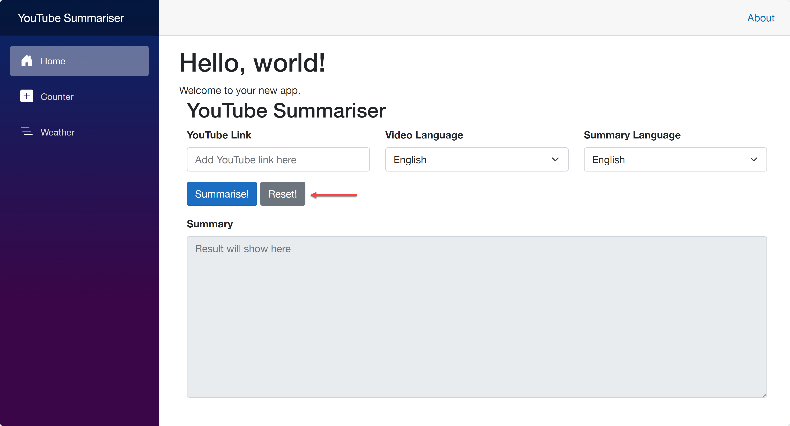
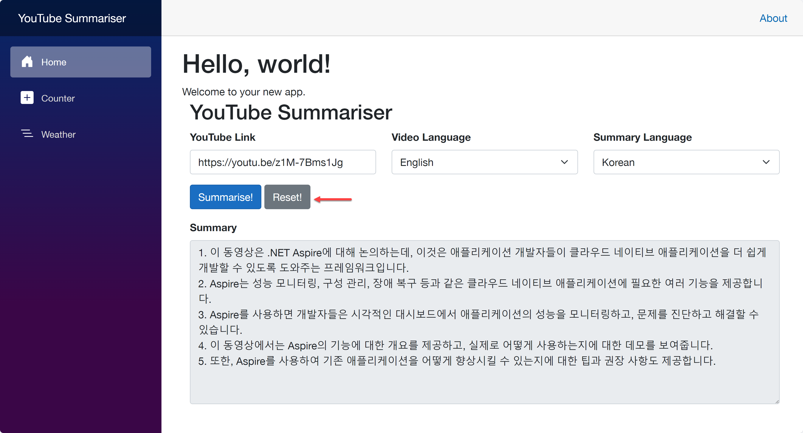

# 세션 05: Azure 배포 - Azure Kubernetes Service

이 세션에서는 [.NET Aspire](https://learn.microsoft.com/ko-kr/dotnet/aspire/get-started/aspire-overview?WT.mc_id=dotnet-121695-juyoo)로 개발한 애플리케이션을 [Aspirate](https://github.com/prom3theu5/aspirational-manifests)를 이용해 [Azure Kubernetes Service(AKS)](https://learn.microsoft.com/ko-kr/azure/aks/intro-kubernetes?WT.mc_id=dotnet-121695-juyoo)로 배포해 보겠습니다.

> [GitHub Codespaces](https://docs.github.com/ko/codespaces/overview) 또는 [Visual Studio Code](https://code.visualstudio.com/?WT.mc_id=dotnet-121695-juyoo) 환경에서 작업하는 것을 기준으로 합니다.


## 05-1: Azure CLI 로그인하기

1. 아래 명령어를 실행시켜 Azure에 로그인합니다.

    ```bash
    # Azure CLI login
    az login
    ```

   > **중요**: GitHub Codespaces를 사용하면서 만약 `az login` 명령어 실행시 새 브라우저 탭이 뜨면서 404 에러가 날 경우, 주소창의 URL 값을 복사해서 새 zsh 터미널을 열고 `curl <복사한 URL>`을 해 줍니다.

1. 로그인이 끝났다면 아래 명령어를 통해 제대로 로그인이 되어 있는지 확인합니다.

    ```bash
    # Azure CLI
    az account show
    ```

## 05-2: Azure CLI로 Azure Kubernetes Service로 배포 준비하기

1. 터미널을 열고 아래 명령어를 차례로 실행시켜 리포지토리의 루트 디렉토리로 이동합니다.

    ```bash
    # GitHub Codespaces
    REPOSITORY_ROOT=$CODESPACE_VSCODE_FOLDER
    cd $REPOSITORY_ROOT

    # bash/zsh
    REPOSITORY_ROOT=$(git rev-parse --show-toplevel)
    cd $REPOSITORY_ROOT

    # PowerShell
    $REPOSITORY_ROOT = git rev-parse --show-toplevel
    cd $REPOSITORY_ROOT
    ```

1. 아래 명령어를 차례로 실행시켜 배포 환경을 준비합니다.

    ```bash
    # bash/zsh
    AZURE_ENV_NAME="{{ GITHUB_ID }}"
    AZ_LOCATION=australiaeast

    # PowerShell
    $AZURE_ENV_NAME = "{{ GITHUB_ID }}"
    $AZ_LOCATION = "australiaeast"
    ```

   > **중요**: `{{ GITHUB_ID }}`는 자신의 GitHub 아이디로 변경해야 합니다. 예를 들어 GitHub 아이디가 `Azure-Samples`라면 `{{ GITHUB_ID }}`를 `Azure-Samples`로 변경하세요.

1. 아래 명령어를 실행시켜 [Azure Container Registry(ACR)](https://learn.microsoft.com/azure/container-registry/container-registry-intro?WT.mc_id=dotnet-121695-juyoo) 및 [Azure Kubernetes Service(AKS)](https://learn.microsoft.com/ko-kr/azure/aks/intro-kubernetes?WT.mc_id=dotnet-121695-juyoo) 클러스터를 생성합니다.

    ```bash
    # bash/zsh
    PROVISIONED=$($REPOSITORY_ROOT/scripts/provision-aks.sh -e $AZURE_ENV_NAME -l $AZ_LOCATION)

    # PowerShell
    $PROVISIONED = & "$REPOSITORY_ROOT/scripts/Provision-AKS.ps1" -AzureEnvName $AZURE_ENV_NAME -Location $AZ_LOCATION
    ```

1. 아래 명령어를 통해 AKS 클러스터에 연결합니다.

    ```bash
    # bash/zsh
    AZ_RESOURCE_GROUP=$(echo $PROVISIONED | jq -r '.resourceGroup')
    AKS_CLUSTER_NAME=$(echo $PROVISIONED | jq -r '.aksClusterName')
    az aks get-credentials \
        -g $AZ_RESOURCE_GROUP \
        -n $AKS_CLUSTER_NAME

    # PowerShell
    $AZ_RESOURCE_GROUP = $($PROVISIONED | ConvertFrom-Json).resourceGroup
    $AKS_CLUSTER_NAME = $($PROVISIONED | ConvertFrom-Json).aksClusterName
    az aks get-credentials `
        -g $AZ_RESOURCE_GROUP `
        -n $AKS_CLUSTER_NAME
    ```

1. 아래 명령어를 통해 ACR에 연결합니다.

    ```bash
    # bash/zsh
    ACR_LOGIN_SERVER=$(echo $PROVISIONED | jq -r '.acrLoginServer')
    ACR_USERNAME=$(echo $PROVISIONED | jq -r '.acrUsername')
    ACR_PASSWORD=$(echo $PROVISIONED | jq -r '.acrPassword')
    docker login $ACR_LOGIN_SERVER -u $ACR_USERNAME -p $ACR_PASSWORD

    # PowerShell
    $ACR_LOGIN_SERVER = $($PROVISIONED | ConvertFrom-Json).acrLoginServer
    $ACR_USERNAME = $($PROVISIONED | ConvertFrom-Json).acrUsername
    $ACR_PASSWORD = $($PROVISIONED | ConvertFrom-Json).acrPassword
    docker login $ACR_LOGIN_SERVER -u $ACR_USERNAME -p $ACR_PASSWORD
    ```

## 05-3: Aspire 프로젝트 준비하기

1. 터미널을 열고 아래 명령어를 차례로 실행시켜 리포지토리의 루트 디렉토리로 이동합니다.

    ```bash
    # GitHub Codespaces
    REPOSITORY_ROOT=$CODESPACE_VSCODE_FOLDER
    cd $REPOSITORY_ROOT

    # bash/zsh
    REPOSITORY_ROOT=$(git rev-parse --show-toplevel)
    cd $REPOSITORY_ROOT

    # PowerShell
    $REPOSITORY_ROOT = git rev-parse --show-toplevel
    cd $REPOSITORY_ROOT
    ```

> 세이브 포인트에서 가져온 프로젝트를 사용하려면 아래 명령어를 차례로 실행시켜 프로젝트를 복원합니다.
> 
> ```bash
> # bash/zsh
> mkdir -p workshop && cp -a save-points/session-04/. workshop/
> cd workshop
> dotnet restore && dotnet build
> 
> # PowerShell
> New-Item -Type Directory -Path workshop -Force && Copy-Item -Path ./save-points/session-04/* -Destination ./workshop -Recurse -Force
> cd workshop
> dotnet restore && dotnet build
> ```

1. `AspireYouTubeSummariser.AppHost` 프로젝트의 `appsettings.Development.json` 파일에 [세션 04: Azure 배포 - Azure Container Apps](./04-azure-deployment-aca.md)에서 등록한 OpenAI 정보를 다시 입력합니다.

    ```json
    "OpenAI": {
      "Endpoint": "{{ Azure OpenAI Proxy Service Endpoint }}",
      "ApiKey": "{{ Azure OpenAI Proxy Service Access Code }}",
      "DeploymentName": "{{ Azure OpenAI Proxy Service Deployment Name }}"
    }
    ```

   > **중요**: `appsettings.json` 파일에 추가한 Azure OpenAI 서비스의 값들은 절대로 GitHub에 커밋하지 마세요. 대신 `appsettings.Development.json` 파일에 추가하세요. `.gitignore` 파일에 이미 `appsettings.Development.json` 파일에 대한 제외 옵션이 추가되어 있습니다.

## 05-4: Aspirate 설치하기

1. 아래 명령어를 통해 Aspirate를 설치합니다.

    ```bash
    dotnet tool install -g aspirate
    ```

## 05-5: Aspirate로 배포하기

1. 아래 디렉토리로 이동합니다.

    ```bash
    cd $REPOSITORY_ROOT/workshop/AspireYouTubeSummariser.AppHost
    ```

1. Aspirate 프로젝트를 초기화 합니다.

    ```bash
    aspirate init -cr $ACR_LOGIN_SERVER --non-interactive
    ```

1. `AspireYouTubeSummariser.AppHost` 프로젝트 디렉토리 아래 `aspirate.json` 파일이 생성된 것을 확인합니다.

1. 아래 명령어를 통해 Aspire 앱을 빌드하고 ACR로 배포합니다.

    ```bash
    aspirate generate --image-pull-policy Always --disable-secrets --include-dashboard false --non-interactive
    ```

   > **NOTE**: 실습의 편의를 위해 `--disable-secrets` 옵션을 사용합니다. 실제로는 패스워드를 사용해야 합니다.

1. `AspireYouTubeSummariser.AppHost` 프로젝트 디렉토리 아래 `aspirate-output` 디렉토리와 `aspirate-sate.json`파일, `manifest.json` 파일이 생성된 것을 확인합니다.

1. 아래 명령어를 통해 AKS 클러스터로 앱을 배포합니다.

    ```bash
    aspirate apply -k $AKS_CLUSTER_NAME --rolling-restart true --non-interactive
    ```

1. 아래 명령어를 통해 AKS 클러스터에 로드밸런서를 추가합니다.

    ```bash
    kubectl apply -f "$REPOSITORY_ROOT/scripts/loadbalancer.yaml"
    ```

1. 아래 명령어를 통해 `webapp-lb` 서비스가 `LoadBalancer` 타입인지 확인합니다. 그리고 외부 IP주소를 확인합니다. 외부 IP 주소는 `EXTERNAL-IP` 열에 나옵니다.

    ```bash
    kubectl get services
    ```

1. 방금 확인한 외부 IP 주소를 웹 브라우저로 접속해서 애플리케이션이 잘 작동하는지 확인합니다.

    ```text
    http://<EXTERNAL-IP>
    ```

## 05-6: 배포된 앱 테스트하기

1. 홈페이지에서 YouTube 링크를 입력하고 `Summarise` 버튼을 클릭합니다.

    

   > YouTube 링크는 무엇이든 상관 없습니다. 여기서는 [https://youtu.be/NN4Zzp-vOrU](https://youtu.be/NN4Zzp-vOrU) 링크를 사용합니다. 혹시나 토큰 길이 관련 에러가 나오는 경우에는 30분 이하의 짧은 동영상을 사용해 보세요.

## 05-7: Aspire 프로젝트 수정 후 다시 배포하기

1. `AspireYouTubeSummariser.WebApp` 프로젝트의 `Components/UI/YouTubeSummariserComponent.razor` 파일을 열고 아래 라인을 수정합니다.

    ```razor
        <div class="row">
            <div class="mb-3">
                <button type="button" class="btn btn-primary" @onclick="SummariseAsync">Summarise!</button>

                @* 수정 전 *@
                <button type="button" class="btn btn-secondary" @onclick="ClearAsync">Clear!</button>

                @* 수정 후 *@
                <button type="button" class="btn btn-secondary" @onclick="ClearAsync">Reset!</button>
            </div>
        </div>
    ```

1. 수정이 끝난 후 아래 명령어를 실행시켜 다시 앱을 배포합니다.

    ```bash
    # 앱 빌드 후 컨테이너 배포
    aspirate build --non-interactive

    # AKS 클러스터 배포
    aspirate apply -k $AKS_CLUSTER_NAME --rolling-restart true --non-interactive
    ```

1. 배포가 끝난 후 다시 외부 IP 주소를 웹 브라우저로 접속한 후 `Reset!` 버튼으로 바뀌었는지 확인합니다.

    ```text
    http://<EXTERNAL-IP>
    ```

    

1. YouTube 링크를 입력하고 `Summarise` 버튼을 클릭합니다.

   > YouTube 링크는 무엇이든 상관 없습니다. 여기서는 [https://youtu.be/NN4Zzp-vOrU](https://youtu.be/NN4Zzp-vOrU) 링크를 사용합니다. 혹시나 토큰 길이 관련 에러가 나오는 경우에는 30분 이하의 짧은 동영상을 사용해 보세요.

1. 요약 결과가 잘 나오는 것을 확인합니다.

    

1. 만약 앱 수정 결과가 반영되지 않았다면, 아래와 같이 컨테이너 이미지를 지우고 다시 배포해 보세요.

    ```bash
    # bash/zsh
    ACR_NAME=$(echo $PROVISIONED | jq -r '.acrName')

    # PowerShell
    $ACR_NAME = $($PROVISIONED | ConvertFrom-Json).acrName

    # AKS 노드 삭제
    aspirate destroy -k $AKS_CLUSTER_NAME --non-interactive

    # 컨테이너 이미지 삭제
    az acr repository delete -n $ACR_NAME --repository apiapp -y
    az acr repository delete -n $ACR_NAME --repository webapp -y

    # Aspirate로 다시 배포
    aspirate build --non-interactive
    aspirate apply -k $AKS_CLUSTER_NAME --rolling-restart true --non-interactive
    ```

   > **NOTE**: 필요한 경우 아래 명령어를 통해 `webapp-lb` 서비스를 삭제하고 다시 생성해야 할 수도 있습니다.
   > 
   > ```bash
   > # 로드 밸런서 삭제
   > kubectl delete -f "$REPOSITORY_ROOT/scripts/loadbalancer.yaml"
   > 
   > # 로드 밸런서 재추가
   > kubectl apply -f "$REPOSITORY_ROOT/scripts/loadbalancer.yaml"
   > ```

1. 아래 명령어를 통해 `webapp-lb` 서비스가 `LoadBalancer` 타입인지 확인합니다. 그리고 외부 IP주소를 확인합니다.

    ```bash
    kubectl get services
    ```

1. 방금 확인한 외부 IP 주소를 웹 브라우저로 접속해서 애플리케이션이 잘 작동하는지 확인합니다.

    ```text
    http://<EXTERNAL-IP>
    ```

   > YouTube 링크는 무엇이든 상관 없습니다. 여기서는 [https://youtu.be/NN4Zzp-vOrU](https://youtu.be/NN4Zzp-vOrU) 링크를 사용합니다. 혹시나 토큰 길이 관련 에러가 나오는 경우에는 30분 이하의 짧은 동영상을 사용해 보세요.

## 05-8: 배포된 앱 삭제하기

1. 아래 명령어를 통해 배포한 모든 리소스를 삭제합니다.

    ```bash
    # bash/zsh
    $REPOSITORY_ROOT/scripts/destroy-aks.sh -e $AZURE_ENV_NAME

    # PowerShell
    & "$REPOSITORY_ROOT/scripts/Destroy-AKS.ps1" -AzureEnvName $AZURE_ENV_NAME
    ```

---

축하합니다! Azure Kubernetes Service 클러스터로 배포해 보는 작업이 끝났습니다.

## 끝내기

지금까지 [GitHub Copilot](https://docs.github.com/ko/copilot/overview-of-github-copilot/about-github-copilot-business) 기능을 활용해서 빠르게 [Blazor 프론트엔드 웹 앱](https://learn.microsoft.com/ko-kr/aspnet/core/blazor?WT.mc_id=dotnet-121695-juyoo)과 [ASP.NET Core 백엔드 API 앱](https://learn.microsoft.com/ko-kr/aspnet/core/fundamentals/apis?WT.mc_id=dotnet-121695-juyoo)을 개발해 봤습니다. 이후 [.NET Aspire](https://learn.microsoft.com/ko-kr/dotnet/aspire/get-started/aspire-overview?WT.mc_id=dotnet-121695-juyoo)를 활용해 Cloud-Native 앱으로 변환시켰고, [Azure Developer CLI](https://learn.microsoft.com/ko-kr/azure/developer/azure-developer-cli/overview?WT.mc_id=dotnet-121695-juyoo)를 이용해 [Azure Container Apps](https://learn.microsoft.com/ko-kr/azure/container-apps/overview?WT.mc_id=dotnet-121695-juyoo)로 배포해 보았습니다. 마지막으로 [Aspirate](https://github.com/prom3theu5/aspirational-manifests)를 이용해 [Azure Kubernetes Service](https://learn.microsoft.com/ko-kr/azure/aks/intro-kubernetes?WT.mc_id=dotnet-121695-juyoo) 클러스터로 배포해 보았습니다.

이 모든 것들에 대해 좀 더 공부해 보고 싶다면 아래 리소스를 참고하세요.

- [What is Blazor?](https://learn.microsoft.com/ko-kr/aspnet/core/blazor?WT.mc_id=dotnet-121695-juyoo)
- [Build your first Blazor app](https://dotnet.microsoft.com/ko-kr/apps/aspnet/web-apps/blazor?WT.mc_id=dotnet-121695-juyoo)
- [What is Aspire?](https://learn.microsoft.com/ko-kr/dotnet/aspire/get-started/aspire-overview?WT.mc_id=dotnet-121695-juyoo)
- [Build your first Aspire app](https://learn.microsoft.com/ko-kr/dotnet/aspire/get-started/quickstart-build-your-first-aspire-app?tabs=dotnet-cli&WT.mc_id=dotnet-121695-juyoo)
- [What is GitHub Copilot?](https://docs.github.com/ko/copilot)
- [Building an intelligent app with Blazor and Azure OpenAI](https://www.youtube.com/watch?v=TH12YSLLe9E&t=8464s)
- [Your stack for building Cloud Native apps](https://www.youtube.com/live/5IjKH-gy2Y0?si=dSMvC7arUeRpqBmz)

---

(**추가 세션**) 이제 [세션 06: Blazor JavaScript Interoperability 적용](./06-blazor-js-interop.md)으로 넘어가세요.
(**추가 세션**) 이제 [세션 07: Semantic Kernel 앱 개발](./07-semantic-kernel.md)으로 넘어가세요.
