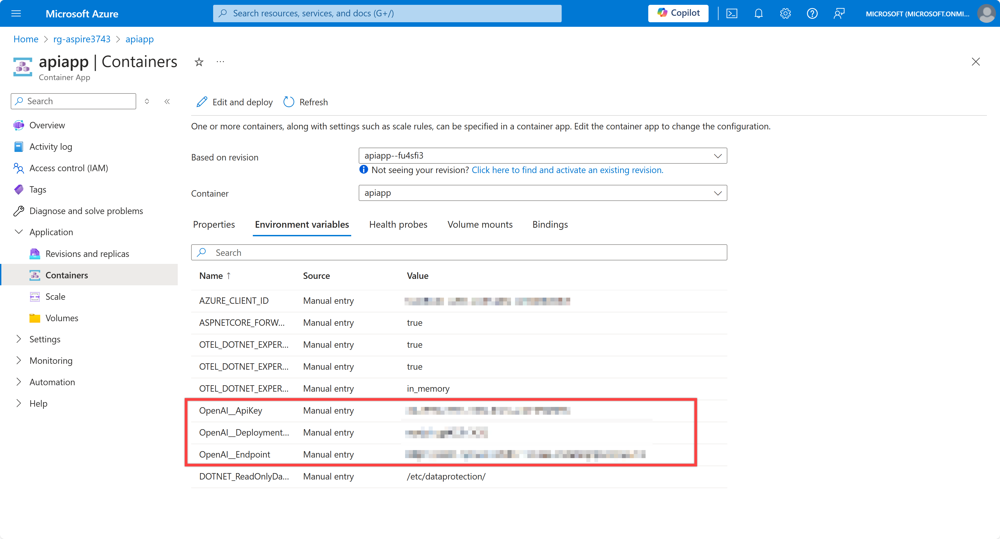

# 세션 05: Azure 배포 - Azure Kubernetes Service

이 세션에서는 [.NET Aspire](https://learn.microsoft.com/ko-kr/dotnet/aspire/get-started/aspire-overview?WT.mc_id=dotnet-121695-juyoo)로 개발한 애플리케이션을 [Aspirate](https://github.com/prom3theu5/aspirational-manifests)를 이용해 [Azure Kubernetes Service(AKS)](https://learn.microsoft.com/ko-kr/azure/aks/intro-kubernetes?WT.mc_id=dotnet-121695-juyoo)로 배포해 보겠습니다.

> [GitHub Codespaces](https://docs.github.com/ko/codespaces/overview) 환경에서 작업하는 것을 기준으로 진행합니다. 로컬 개발 환경의 [Visual Studio Code](https://code.visualstudio.com/?WT.mc_id=dotnet-121695-juyoo)를 사용할 경우 대부분 비슷하지만 살짝 다를 수 있습니다.


## 05-1: Azure CLI 로그인하기

1. GitHub Codespaces 인스턴스 안에서 아래 명령어를 실행시켜 Azure에 로그인합니다.

    ```bash
    # Azure CLI login
    az login
    ```

   > **중요**: 만약 `az login` 명령어 실행시 새 브라우저 탭이 뜨면서 404 에러가 날 경우, 주소창의 URL 값을 복사해서 새 zsh 터미널을 열고 `curl <복사한 URL>`을 해 줍니다.

1. 로그인이 끝났다면 아래 명령어를 통해 제대로 로그인이 되어 있는지 확인합니다.

    ```bash
    # Azure CLI
    az account show
    ```

## 05-2: Azure CLI로 Azure Kubernetes Service로 배포 준비하기

1. 아래 명령어를 차례로 실행시켜 배포 환경을 준비합니다.

    ```bash
    AZURE_ENV_NAME="aspir8$RANDOM"
    AZ_RESOURCE_GROUP=rg-$AZURE_ENV_NAME
    AZ_NODE_RESOURCE_GROUP=rg-$AZURE_ENV_NAME-mc
    AZ_LOCATION=koreacentral
    ACR_NAME=acr$AZURE_ENV_NAME
    AKS_CLUSTER_NAME=aks-$AZURE_ENV_NAME
    ```

1. 아래 명령어를 실행시켜 리소스 그룹을 생성합니다.

    ```bash
    az group create -n $AZ_RESOURCE_GROUP -l $AZ_LOCATION
    ```

1. 아래 명령어를 실행시켜 [Azure Container Registry(ACR)](https://learn.microsoft.com/azure/container-registry/container-registry-intro?WT.mc_id=dotnet-121695-juyoo) 인스턴스를 생성합니다.

    ```bash
    az acr create \
        -g $AZ_RESOURCE_GROUP \
        -n $ACR_NAME \
        -l $AZ_LOCATION \
        --sku Basic \
        --admin-enabled true
    ```

1. 아래 명령어를 실행시켜 ACR 로그인 디테일을 저장합니다.

    ```bash
    ACR_LOGIN_SERVER=$(az acr show \
        -g $AZ_RESOURCE_GROUP \
        -n $ACR_NAME \
        --query "loginServer" -o tsv)
    ACR_USERNAME=$(az acr credential show \
        -g $AZ_RESOURCE_GROUP \
        -n $ACR_NAME \
        --query "username" -o tsv)
    ACR_PASSWORD=$(az acr credential show \
        -g $AZ_RESOURCE_GROUP \
        -n $ACR_NAME \
        --query "passwords[0].value" -o tsv)
    ```

1. 아래 명령어를 실행시켜 AKS 클러스터를 생성합니다.

    ```bash
    az aks create \
        -g $AZ_RESOURCE_GROUP \
        -n $AKS_CLUSTER_NAME \
        -l $AZ_LOCATION \
        --node-resource-group $AZ_NODE_RESOURCE_GROUP \
        --node-vm-size Standard_B2s \
        --network-plugin azure \
        --generate-ssh-keys \
        --attach-acr $ACR_NAME
    ```

1. 아래 명령어를 통해 AKS 클러스터에 연결합니다.

    ```bash
    az aks get-credentials \
        -g $AZ_RESOURCE_GROUP \
        -n $AKS_CLUSTER_NAME
    ```

1. 아래 명령어를 통해 ACR에 연결합니다.

   > **NOTE**: 여기서는 username과 password 값을 입력했지만, 실제로는 인풋 프롬프트를 통해 입력해야 합니다.

    ```bash
    docker login $ACR_LOGIN_SERVER -u $ACR_USERNAME -p $ACR_PASSWORD
    ```

## 05-3: Aspire 프로젝트 준비하기

1. 아래 명령어를 차례로 실행시켜 Aspire 프로젝트를 복원합니다.

    ```bash
    cd $CODESPACE_VSCODE_FOLDER
    mkdir -p workshop && cp -a save-points/session-04/. workshop/
    cd workshop
    dotnet restore && dotnet build
    ```

## 05-4: Aspirate 설치하기

1. 아래 명령어를 통해 Aspirate를 설치합니다.

```bash
dotnet tool install -g aspirate --prerelease
```

## 05-5: Aspirate로 배포하기

1. 아래 디렉토리로 이동합니다.

    ```bash
    cd $CODESPACE_VSCODE_FOLDER/workshop/AspireYouTubeSummariser.AppHost
    ```

1. Aspirate 프로젝트를 초기화 합니다.

    ```bash
    aspirate init -cr $ACR_LOGIN_SERVER -ct latest --non-interactive
    ```

   > **NOTE**: 만약 `enter or skip the repository prefix` 라는 질문이 나오면 `n`을 입력해서 건너뜁니다.

1. 아래 명령어를 통해 Aspire 앱을 빌드하고 ACR로 배포합니다.

    ```bash
    aspirate generate --image-pull-policy Always --disable-secrets --non-interactive
    ```

   > **NOTE**: 실습의 편의를 위해 `--disable-secrets` 옵션을 사용합니다. 실제로는 패스워드를 사용해야 합니다.

1. 아래 명령어를 통해 AKS 클러스터로 앱을 배포합니다.

    ```bash
    aspirate apply -k $AKS_CLUSTER_NAME --non-interactive
    ```

1. 아래 명령어를 통해 AKS 클러스터에 로드밸런서를 추가합니다.

    ```bash
    kubectl apply -f - <<EOF
    apiVersion: v1
    kind: Service
    metadata:
      name: webapp-lb
    spec:
      ports:
      - port: 80
        targetPort: 8080
      selector:
        app: webapp
      type: LoadBalancer
    EOF
    ```

1. 아래 명령어를 통해 `webapp-lb` 서비스가 `LoadBalancer` 타입인지 확인합니다. 그리고 외부 IP주소를 확인합니다.

    ```bash
    kubectl get services
    ```

1. 방금 확인한 외부 IP 주소를 웹 브라우저로 접속해서 애플리케이션이 잘 작동하는지 확인합니다.

    ```text
    http://<EXTERNAL_IP_ADDRESS>
    ```

## 05-6: 배포된 앱 테스트하기

1. 홈페이지에서 YouTube 링크를 입력하고 `Summarise` 버튼을 클릭합니다.

    

   > YouTube 링크는 무엇이든 상관 없습니다. 여기서는 [https://youtu.be/z1M-7Bms1Jg](https://youtu.be/z1M-7Bms1Jg) 링크를 사용합니다.

## 05-7: Aspire 프로젝트 수정 후 다시 배포하기

1. `AspireYouTubeSummariser.WebApp` 프로젝트의 `Components/UI/YouTubeSummariserComponent.razor` 파일을 열고 아래 라인을 수정합니다.

    ```razor
        <div class="row">
            <div class="mb-3">
                <button type="button" class="btn btn-primary" @onclick="SummariseAsync">Summarise!</button>

                @* 수정 전 *@
                <button type="button" class="btn btn-secondary" @onclick="ClearAsync">Clear!</button>

                @* 수정 후 *@
                <button type="button" class="btn btn-secondary" @onclick="ClearAsync">Reset!</button>
            </div>
        </div>
    ```

1. 수정이 끝난 후 아래 명령어를 실행시켜 다시 앱을 배포합니다.

    ```bash
    # 앱 빌드 후 컨테이너 배포
    aspirate build --non-interactive

    # AKS 클러스터 배포
    aspirate apply -k $AKS_CLUSTER_NAME --non-interactive
    ```

1. 배포가 끝난 후 다시 외부 IP 주소를 웹 브라우저로 접속해서 YouTube 링크를 입력하고 `Summarise` 버튼을 클릭합니다.

    ```text
    http://<EXTERNAL_IP_ADDRESS>
    ```

    

   > YouTube 링크는 무엇이든 상관 없습니다. 여기서는 [https://youtu.be/z1M-7Bms1Jg](https://youtu.be/z1M-7Bms1Jg) 링크를 사용합니다.

1. 요약 결과가 잘 나오는 것을 확인합니다.

    

1. 만약 앱 수정 결과가 반영되지 않았다면, 아래와 같이 컨테이너 이미지를 지우고 다시 배포해 보세요.

    ```bash
    # AKS 노드 삭제
    aspirate destroy -k $AKS_CLUSTER_NAME --non-interactive

    # 컨테이너 이미지 삭제
    az acr repository delete -n $ACR_NAME --repository webapp -y
    az acr repository delete -n $ACR_NAME --repository apiapp -y

    # Aspirate로 다시 배포
    aspirate build --non-interactive
    aspirate apply -k $AKS_CLUSTER_NAME --non-interactive
    ```

   > **NOTE**: 필요한 경우 아래 명령어를 통해 `webapp-lb` 서비스를 삭제하고 다시 생성해야 할 수도 있습니다.
   > 
   > ```bash
   > # 로드 밸런서 삭제
   > kubectl delete -f - <<EOF
   > apiVersion: v1
   > kind: Service
   > metadata:
   >   name: webapp-lb
   > spec:
   >   ports:
   >   - port: 80
   >     targetPort: 8080
   >   selector:
   >     app: webapp
   >   type: LoadBalancer
   > EOF
   > 
   > # 로드 밸런서 재추가
   > kubectl apply -f - <<EOF
   > apiVersion: v1
   > kind: Service
   > metadata:
   >   name: webapp-lb
   > spec:
   >   ports:
   >   - port: 80
   >     targetPort: 8080
   >   selector:
   >     app: webapp
   >   type: LoadBalancer
   > EOF
   > ```

---

축하합니다! Azure Kubernetes Serive 클러스터로 배포해 보는 작업이 끝났습니다.

## 끝내기

지금까지 [GitHub Codespaces](https://docs.github.com/ko/codespaces/overview) 환경에서 [Blazor 프론트엔드 웹 앱](https://learn.microsoft.com/ko-kr/aspnet/core/blazor?WT.mc_id=dotnet-121695-juyoo)과 [ASP.NET Core 백엔드 API 앱](https://learn.microsoft.com/ko-kr/aspnet/core/fundamentals/apis?WT.mc_id=dotnet-121695-juyoo)을 개발해 봤습니다. 이후 [.NET Aspire](https://learn.microsoft.com/ko-kr/dotnet/aspire/get-started/aspire-overview?WT.mc_id=dotnet-121695-juyoo)를 활용해 Cloud-Native 앱으로 변환시켰고, [Azure Developer CLI](https://learn.microsoft.com/ko-kr/azure/developer/azure-developer-cli/overview?WT.mc_id=dotnet-121695-juyoo)를 이용해 [Azure Container Apps](https://learn.microsoft.com/ko-kr/azure/container-apps/overview?WT.mc_id=dotnet-121695-juyoo)로 배포해 보았습니다. 또한 [Azure CLI](https://learn.microsoft.com/ko-kr/cli/azure/what-is-azure-cli?WT.mc_id=dotnet-121695-juyoo)와 [Aspirate](https://github.com/prom3theu5/aspirational-manifests)를 이용해 [Azure Kubernetes Service(AKS)](https://learn.microsoft.com/ko-kr/azure/aks/intro-kubernetes?WT.mc_id=dotnet-121695-juyoo)로 배포해 보았습니다.

<!-- 지금까지 [GitHub Codespaces](https://docs.github.com/ko/codespaces/overview) 환경에서 [GitHub Copilot](https://docs.github.com/ko/copilot/overview-of-github-copilot/about-github-copilot-business) 기능을 활용해서 빠르게 [Blazor 프론트엔드 웹 앱](https://learn.microsoft.com/ko-kr/aspnet/core/blazor?WT.mc_id=dotnet-121695-juyoo)과 [ASP.NET Core 백엔드 API 앱](https://learn.microsoft.com/ko-kr/aspnet/core/fundamentals/apis?WT.mc_id=dotnet-121695-juyoo)을 개발해 봤습니다. 이후 [.NET Aspire](https://learn.microsoft.com/ko-kr/dotnet/aspire/get-started/aspire-overview?WT.mc_id=dotnet-121695-juyoo)를 활용해 Cloud-Native 앱으로 변환시켰고, [Azure Developer CLI](https://learn.microsoft.com/ko-kr/azure/developer/azure-developer-cli/overview?WT.mc_id=dotnet-121695-juyoo)를 이용해 [Azure Container Apps](https://learn.microsoft.com/ko-kr/azure/container-apps/overview?WT.mc_id=dotnet-121695-juyoo)로 배포해 보았습니다. -->

이 모든 것들에 대해 좀 더 공부해 보고 싶다면 아래 리소스를 참고하세요.

- [What is Blazor?](https://learn.microsoft.com/ko-kr/aspnet/core/blazor?WT.mc_id=dotnet-121695-juyoo)
- [Build your first Blazor app](https://dotnet.microsoft.com/ko-kr/apps/aspnet/web-apps/blazor?WT.mc_id=dotnet-121695-juyoo)
- [What is Aspire?](https://learn.microsoft.com/ko-kr/dotnet/aspire/get-started/aspire-overview?WT.mc_id=dotnet-121695-juyoo)
- [Build your first Aspire app](https://learn.microsoft.com/ko-kr/dotnet/aspire/get-started/quickstart-build-your-first-aspire-app?tabs=dotnet-cli&WT.mc_id=dotnet-121695-juyoo)
<!-- - [What is GitHub Copilot?](https://docs.github.com/ko/copilot) -->
- [Building an intelligent app with Blazor and Azure OpenAI](https://www.youtube.com/watch?v=TH12YSLLe9E&t=8464s)
- [Your stack for building Cloud Native apps](https://www.youtube.com/live/5IjKH-gy2Y0?si=dSMvC7arUeRpqBmz)
