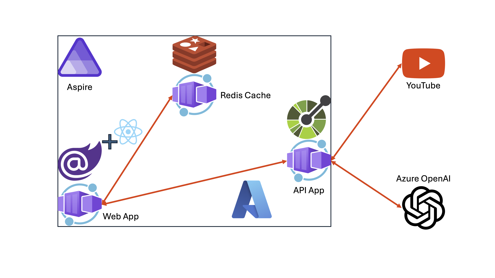

# 세션 06: Blazor JavaScript Interoperability 적용

이 세션에서는 [Blazor 프론트엔드 웹 앱](https://learn.microsoft.com/ko-kr/aspnet/core/blazor?WT.mc_id=dotnet-121695-juyoo)의 [JS Interop 기능](https://learn.microsoft.com/ko-kr/aspnet/core/blazor/javascript-interoperability/?WT.mc_id=dotnet-121695-juyoo)을 활용해 React 기반의 UI 컴포넌트를 통합해 보겠습니다.

> [GitHub Codespaces](https://docs.github.com/ko/codespaces/overview) 또는 [Visual Studio Code](https://code.visualstudio.com/?WT.mc_id=dotnet-121695-juyoo) 환경에서 작업하는 것을 기준으로 합니다.

> [node.js](https://nodejs.org/en/download) 18+ 버전을 사용하고 있는지 확인해 주세요.



## 06-1: React 기반 UI 컴포넌트 생성하기 - Fluid UI Progress Indicator

1. 터미널을 열고 아래 명령어를 차례로 실행시켜 리포지토리의 루트 디렉토리로 이동합니다.

    ```bash
    # GitHub Codespaces
    REPOSITORY_ROOT=$CODESPACE_VSCODE_FOLDER
    cd $REPOSITORY_ROOT

    # bash/zsh
    REPOSITORY_ROOT=$(git rev-parse --show-toplevel)
    cd $REPOSITORY_ROOT

    # PowerShell
    $REPOSITORY_ROOT = git rev-parse --show-toplevel
    cd $REPOSITORY_ROOT
    ```

> 세이브 포인트에서 가져온 프로젝트를 사용하려면 아래 명령어를 차례로 실행시켜 프로젝트를 복원합니다.
> 
> ```bash
> # bash/zsh
> mkdir -p workshop && cp -a save-points/session-05/. workshop/
> cd workshop
> dotnet restore && dotnet build
> 
> # PowerShell
> New-Item -Type Directory -Path workshop -Force && Copy-Item -Path ./save-points/session-05/* -Destination ./workshop -Recurse -Force
> cd workshop
> dotnet restore && dotnet build
> ```

1. `AspireYouTubeSummariser.WebApp` 프로젝트에 `JSInterop` 디렉토리를 생성합니다.

    ```bash
    # bash/zsh
    mkdir -p $REPOSITORY_ROOT/workshop/AspireYouTubeSummariser.WebApp/JSInterop
    cd $REPOSITORY_ROOT/workshop/AspireYouTubeSummariser.WebApp/JSInterop

    # PowerShell
    New-Item -Type Directory -Path $REPOSITORY_ROOT/workshop/AspireYouTubeSummariser.WebApp/JSInterop -Force
    cd $REPOSITORY_ROOT/workshop/AspireYouTubeSummariser.WebApp/JSInterop
    ```

1. 아래 명령어를 실행시켜 node.js 기반의 React 프로젝트를 생성합니다.

    ```bash
    npm init
    ```

   초기화 과정에서 물어보는 아래의 질문에는 엔터키를 눌러 기본값으로 설정하고 지나갑니다.

    ```text
    package name:
    version:
    description:
    entry point:
    test command:
    git repository:
    keywords:
    author:
    license:
    ```

1. 생성된 `package.json` 파일을 열고 아래 내용으로 수정합니다.

    ```json
    {
      "scripts": {
        // 수정 전
        "test": "echo \"Error: no test specified\" && exit 1"
    
        // 수정 후
        "build": "webpack --mode production"
      },
    }
    ```

1. 아래 명령어를 차례로 실행시켜 npm 패키지를 설치합니다.

    ```bash
    npm install --save-dev @babel/core babel-loader webpack webpack-cli
    npm install @fluentui/react react react-dom
    ```

1. `webpack.config.js` 파일을 생성합니다.

    ```bash
    # bash/zsh
    touch webpack.config.js
    
    # PowerShell
    New-Item -Type File -Name webpack.config.js -Force
    ```

1. `webpack.config.js` 파일에 아래 내용을 입력합니다.

    ```nodejs
    const path = require("path");
    
    module.exports = {
      module: {
        rules: [
          {
            test: /\.js$/,
            exclude: /node_modules/,
            use: {
              loader: "babel-loader"
            }
          }
        ]
      },
      output: {
        path: path.resolve(__dirname, '../wwwroot/js'),
        filename: "bundle.js",
        library: "YouTube",
        libraryTarget: "window"
      }
    };
    ```

1. `src` 디렉토리를 만들고 그 아래 `index.js` 파일을 생성합니다.

    ```bash
    # bash/zsh
    mkdir -p src
    touch src/index.js
    
    # PowerShell
    New-Item -Type Directory -Name src -Force
    New-Item -Type File -Name index.js -Path src -Force
    ```

1. `index.js` 파일에 아래와 같이 입력합니다.

    ```nodejs
    import { renderProgressBar } from './progressbar';
    
    export function RenderProgressBar() {
      return renderProgressBar();
    }
    ```

1. `src` 디렉토리 밑에 `progressbar.js` 파일을 생성합니다.

    ```bash
    # bash/zsh
    touch src/progressbar.js
    
    # PowerShell
    New-Item -Type File -Name progressbar.js -Path src -Force
    ```

1. `src` 디렉토리 밑에 `progressbar.js` 파일을 생성한 후 아래와 같이 입력합니다.

    ```nodejs
    import * as React from 'react';
    import ReactDOM from 'react-dom';
    import { ProgressIndicator } from '@fluentui/react/lib/ProgressIndicator';
    
    export function renderProgressBar(count) {
        const Progress = () => React.createElement(
            ProgressIndicator,
            {
                'label': 'Summarising...',
                'description': ''
            },
            null
        );
    
        ReactDOM.render(Progress(), document.getElementById('progressBar'));
    }
    ```

## 06-2: Blazor 프론트엔드 웹 앱에 React 기반 UI 컴포넌트 통합하기

1. `AspireYouTubeSummariser.WebApp` 프로젝트의 `AspireYouTubeSummariser.WebApp.csproj` 파일을 열어 프로젝트를 빌드할 때 앞서 작성했던 React UI 컴포넌트 역시 동시에 빌드될 수 있게 설정합니다.

    ```xml
    <Project Sdk="Microsoft.NET.Sdk.Web">
    
      <PropertyGroup>
        <!-- 추가 -->
        <JSInteropRoot>JSInterop/</JSInteropRoot>
        <DefaultItemExcludes>$(DefaultItemExcludes);$(JSInteropRoot)node_modules/**</DefaultItemExcludes>
      </PropertyGroup>
    
      <!-- 추가 -->
      <ItemGroup>
        <Content Remove="$(JSInteropRoot)**" />
        <None Remove="$(JSInteropRoot)**" />
        <None Include="$(JSInteropRoot)**" Exclude="$(JSInteropRoot)node_modules/**" />
      </ItemGroup>
    
      ...
    
      <!-- 추가 -->
      <Target Name="PublishRunWebpack" AfterTargets="Build">
        <!-- As part of publishing, ensure the JS resources are freshly built in production mode -->
        <Exec WorkingDirectory="$(JSInteropRoot)" Command="npm install" />
        <Exec WorkingDirectory="$(JSInteropRoot)" Command="npm run build" />
      </Target>
    
    </Project>
    ```

1. `AspireYouTubeSummariser.WebApp` 프로젝트의 `Components/UI` 디렉토리에 있는 `YouTubeSummariserComponent.razor` 파일을 열고 `@inject IApiAppClient ApiApp` 라인 아래 아래와 같이 수정합니다.

    ```razor
    @inject IApiAppClient ApiApp
    
    @* 추가 *@
    @inject IJSRuntime JSR
    ```

1. 같은 파일에서 HTML 버튼 아래 아래와 같이 HTML 엘리먼트를 추가합니다.

    ```razor
    <div class="row">
        <div class="mb-3">
            <button type="button" class="btn btn-primary" @onclick="SummariseAsync">Summarise!</button>
            <button type="button" class="btn btn-secondary" @onclick="ClearAsync">Clear!</button>
        </div>
    </div>
    
    @* 추가 *@
    <div class="row">
        <div class="mb-3">
            <div id="progressBar" hidden="@summaryCompleted"></div>
        </div>
    </div>
    ```

1. 같은 파일에서 `@code` 블록을 아래와 같이 수정합니다.

    ```razor
    @code {
        ...
        
        private string summaryResult = string.Empty;
        
        // 추가
        private bool summaryCompleted;
        
        private async Task SummariseAsync()
        {
            // 추가
            summaryCompleted = false;
            await JSR.InvokeVoidAsync("YouTube.RenderProgressBar");
    
            var result = await ApiApp.SummariseAsync(youTubeLinkUrl, videoLanguageCode, summaryLanguageCode);
            summaryResult = result;
        
            // 추가
            summaryCompleted = true;
        }
    
        ...
    }    
    ```

1. `AspireYouTubeSummariser.WebApp` 프로젝트의 `Components` 디렉토리에 있는 `App.razor` 파일을 열고 `<script src="_framework/blazor.web.js"></script>` 라인을 찾아 아래와 같이 수정합니다.

```html
<script src="_framework/blazor.web.js"></script>

<!-- 추가 -->
<script src="js/bundle.js"></script>
```

## 06-3: Aspire 프로젝트 빌드 및 실행하기

1. `AspireYouTubeSummariser.AppHost` 프로젝트의 `appsettings.Development.json` 파일에 [세션 05: Azure 배포 - Azure Kubernetes Service](./05-azure-deployment-aks.md)에서 등록한 OpenAI 정보를 다시 입력합니다.

    ```json
    "OpenAI": {
      "Endpoint": "{{ Azure OpenAI Proxy Service Endpoint }}",
      "ApiKey": "{{ Azure OpenAI Proxy Service Access Code }}",
      "DeploymentName": "{{ Azure OpenAI Proxy Service Deployment Name }}"
    }
    ```

   > **중요**: `appsettings.json` 파일에 추가한 Azure OpenAI 서비스의 값들은 절대로 GitHub에 커밋하지 마세요. 대신 `appsettings.Development.json` 파일에 추가하세요. `.gitignore` 파일에 이미 `appsettings.Development.json` 파일에 대한 제외 옵션이 추가되어 있습니다.

1. Solution Explorer에서 `AspireYouTubeSummariser.AppHost` 프로젝트를 선택하고 마우스 오른쪽 버튼을 눌러 디버깅 모드로 실행합니다.

   > 또는 아래 명령어를 차례로 실행시켜 앱을 실행합니다.
   > 
   > ```bash
   > cd $REPOSITORY_ROOT/workshop
   > dotnet watch run --project AspireYouTubeSummariser.AppHost
   > ```

1. 대시보드 페이지를 열고 Blazor 프론트엔드 웹 앱을 실행시킵니다.
1. 홈페이지에서 YouTube 링크를 입력하고 `Summarise` 버튼을 클릭합니다.

   > YouTube 링크는 무엇이든 상관 없습니다. 여기서는 [https://youtu.be/NN4Zzp-vOrU](https://youtu.be/NN4Zzp-vOrU) 링크를 사용합니다. 혹시나 토큰 길이 관련 에러가 나오는 경우에는 30분 이하의 짧은 동영상을 사용해 보세요.

1. `Summarising...`이라는 텍스트와 함께 진행 상태바가 움직이는 것을 확인합니다.
1. 디버깅 모드를 종료합니다. 또는 터미널 창에서 웹 앱을 실행시켰을 경우 `CTRL`+`C` 키를 눌러 실행을 중지합니다.

## 06-4: Aspire 프로젝트 배포하기

1. 아래 명령어를 차례로 실행시켜 배포 환경을 준비합니다.

    ```bash
    # bash/zsh
    cd $REPOSITORY_ROOT/workshop
    AZURE_ENV_NAME="{{ GITHUB_ID }}"
    azd init -e $AZURE_ENV_NAME

    # PowerShell
    cd $REPOSITORY_ROOT/workshop
    $AZURE_ENV_NAME = "{{ GITHUB_ID }}"
    azd init -e $AZURE_ENV_NAME
    ```

   > **중요**: `{{ GITHUB_ID }}`는 자신의 GitHub 아이디로 변경해야 합니다. 예를 들어 GitHub 아이디가 `Azure-Samples`라면 `{{ GITHUB_ID }}`를 `Azure-Samples`로 변경하세요.

1. 아래 명령어를 실행시켜 앱을 배포합니다.

    ```bash
    azd up
    ```

1. 어떤 Azure 구독을 사용할 것인지 물어봅니다. 사용할 구독을 선택합니다.
1. 어느 지역에 배포할 것인지 물어봅니다. 아무 지역이나 선택해도 되지만, 여기서는 `Korea Central`을 선택합니다.
1. 배포가 끝난 후 `webapp` 컨테이너 앱을 실행시켜 홈페이지에서 YouTube 링크를 입력하고 `Summarise` 버튼을 클릭합니다.

   > YouTube 링크는 무엇이든 상관 없습니다. 여기서는 [https://youtu.be/NN4Zzp-vOrU](https://youtu.be/NN4Zzp-vOrU) 링크를 사용합니다. 혹시나 토큰 길이 관련 에러가 나오는 경우에는 30분 이하의 짧은 동영상을 사용해 보세요.

1. `Summarising...`이라는 텍스트와 함께 진행 상태바가 움직이는 것을 확인합니다.

## 06-5: 배포된 앱 삭제하기

1. 아래 명령어를 통해 배포한 앱을 삭제합니다.

    ```bash
    azd down --purge --force
    ```

---

축하합니다! Blazor 프론트엔드 웹 앱에 JS Interop 기능을 통해 React 기반의 UI 컴포넌트를 통합하는 작업이 끝났습니다.

(**추가 세션**) 이제 [세션 07: Semantic Kernel 앱 개발](./07-semantic-kernel.md)으로 넘어가세요.
