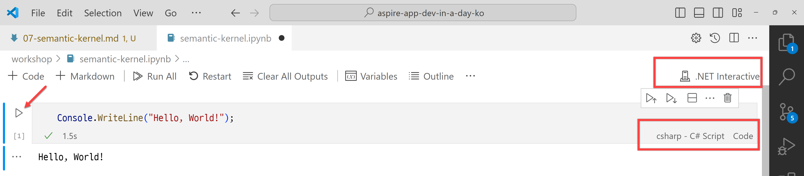

# 세션 07: Semantic Kernel 앱 개발

이 세션에서는 [Polyglot Notebooks](https://marketplace.visualstudio.com/items?itemName=ms-dotnettools.dotnet-interactive-vscode)과 [Semantic Kernel](https://learn.microsoft.com/ko-kr/semantic-kernel/overview/?WT.mc_id=dotnet-121695-juyoo)을 이용해서 지능형 .NET 콘솔 앱을 개발해 보겠습니다.

> [GitHub Codespaces](https://docs.github.com/ko/codespaces/overview) 또는 [Visual Studio Code](https://code.visualstudio.com/?WT.mc_id=dotnet-121695-juyoo) 환경에서 작업하는 것을 기준으로 합니다.

## 07-0: 사전 준비사항

아래 Visual Studio Code 확장 기능을 설치합니다.

- [Polyglot Notebooks](https://marketplace.visualstudio.com/items?itemName=ms-dotnettools.dotnet-interactive-vscode)

## 07-1: 노트북 파일 생성하기

1. 터미널을 열고 아래 명령어를 차례로 실행시켜 리포지토리의 루트 디렉토리로 이동합니다.

    ```bash
    # GitHub Codespaces
    REPOSITORY_ROOT=$CODESPACE_VSCODE_FOLDER
    cd $REPOSITORY_ROOT

    # bash/zsh
    REPOSITORY_ROOT=$(git rev-parse --show-toplevel)
    cd $REPOSITORY_ROOT

    # PowerShell
    $REPOSITORY_ROOT = git rev-parse --show-toplevel
    cd $REPOSITORY_ROOT
    ```

> 세이브 포인트에서 가져온 프로젝트를 사용하려면 아래 명령어를 차례로 실행시켜 프로젝트를 복원합니다.
> 
> ```bash
> # bash/zsh
> mkdir -p workshop && cp -a save-points/session-06/. workshop/
> cd workshop
> dotnet restore && dotnet build
> 
> # PowerShell
> New-Item -Type Directory -Path workshop -Force && Copy-Item -Path ./save-points/session-06/* -Destination ./workshop -Recurse -Force
> cd workshop
> dotnet restore && dotnet build
> ```

1. 아래 명령어를 실행시켜 `workshop` 디렉토리 바로 밑에 `semantic-kernel.ipynb` 파일을 생성합니다.

    ```bash
    # bash/zsh
    touch $REPOSITORY_ROOT/workshop/semantic-kernel.ipynb

    # PowerShell
    New-Item -Type File -Path $REPOSITORY_ROOT/workshop/semantic-kernel.ipynb -Force
    ```

1. `semantic-kernel.ipynb` 파일을 열고 아래와 같이 입력합니다.

    ```csharp-interactive
    Console.WriteLine("Hello, World!");
    ```

1. 아래 그림과 같이 셀 왼쪽의 ▶️ 버튼을 클릭해서 코드를 실행시킵니다. 이 때 `.NET Interactive`, `csharp - C# Script`, `Code` 설정이 제대로 되어 있는지 확인합니다.

    

## 07-2: Semantic Kernel 앱 실행하기

1. `semantic-kernel.ipynb` 파일을 열고 앞서 입력한 셀의 내용을 아래와 같이 수정합니다.

    ```csharp-interactive
    // Nuget Packages
    #r "nuget: MelonChart.NET, 1.*"
    
    #r "nuget: Microsoft.SemanticKernel, 1.*"
    #r "nuget: Microsoft.SemanticKernel.Connectors.OpenAI, 1.*"
    #r "nuget: Microsoft.SemanticKernel.Core, 1.*"
    #r "nuget: Microsoft.SemanticKernel.Plugins.Core, 1.*-*"
    #r "nuget: Microsoft.SemanticKernel.Plugins.Memory, 1.*-*"
    
    #r "nuget: System.Linq.Async, 6.*"
    ```

   이후 셀을 실행시켜 NuGet 패키지를 설치합니다.

1. 새 코드 셀을 아래에 추가한 후, 아래와 같이 `using` 디렉티브를 입력합니다.

    ```csharp-interactive
    // Add using statements
    using System.ComponentModel;
    using System.Net.Http;
    using System.Text.Encodings.Web;
    using System.Text.Json;
    using System.Text.Json.Serialization;
    
    using MelonChart.Models;
    
    using Microsoft.SemanticKernel;
    using Microsoft.SemanticKernel.Connectors.OpenAI;
    using Microsoft.SemanticKernel.Memory;

    using Kernel = Microsoft.SemanticKernel.Kernel;
    ```

   이후 셀을 실행시킵니다.

1. 새 코드 셀을 아래에 추가한 후, 아래와 같이 입력하고 `endpoint`와 `apiKey`, `deploymentName` 값을 추가합니다. 이 값들은 이미 [세션 00: 개발 환경 설정](./00-setup.md)에서 받았습니다.

    ```csharp-interactive
    // Azure OpenAI configurations
    var endpoint = "<AZURE_OPENAI_ENDPOINT>";
    var apiKey = "<AZURE_OPENAI_API_KEY>";
    var deploymentName = "<AZURE_OPENAI_DEPLOYMENT_NAME>";
    ```

   이후 셀을 실행시킵니다.

1. 새 코드 셀을 아래에 추가한 후, 아래와 같이 입력합니다.

    ```csharp-interactive
    // Build Semantic Kernel
    var kernel = Kernel.CreateBuilder()
                       .AddAzureOpenAIChatCompletion(
                           deploymentName: deploymentName,
                           endpoint: endpoint,
                           apiKey: apiKey)
                       .Build();
    ```

   이후 셀을 실행시킵니다.

1. 새 코드 셀을 아래에 추가한 후, 아래와 같이 입력합니다.

    ```csharp-interactive
    // Invoke the prompt
    var result = await kernel.InvokePromptAsync<string>("대구는 왜 더울까?");

    Console.WriteLine(result);
    ```

   이후 셀을 실행시켜 결과를 확인합니다.

1. `Invoke the prompt` 셀 바로 위에 새 코드 셀을 추가한 후, 아래와 같이 입력합니다.

    ```csharp-interactive
    // User input
    var question = await Microsoft.DotNet.Interactive.Kernel.GetInputAsync("무엇이 궁금한가요?");
    
    Console.WriteLine($"User: {question}");
    ```

   이후 셀을 실행시켜 결과를 확인합니다.

1. `Invoke the prompt` 셀을 아래와 같이 수정합니다.

    ```csharp-interactive
    // Invoke the prompt

    // 수정 전
    var result = await kernel.InvokePromptAsync<string>("대구는 왜 더울까?");

    // 수정 후
    var result = await kernel.InvokePromptAsync<string>(question);

    Console.WriteLine(result);
    ```

   이후 셀을 실행시켜 결과를 확인합니다.

## 07-3: 프롬프트 추가하기

1. 아래 명령어를 실행시켜 `GetIntent`라는 프롬프트를 추가합니다.

    ```bash
    # bash/zsh
    mkdir -p $REPOSITORY_ROOT/workshop/Prompts/GetIntent
    touch $REPOSITORY_ROOT/workshop/Prompts/GetIntent/config.json
    touch $REPOSITORY_ROOT/workshop/Prompts/GetIntent/skprompt.txt
    
    # PowerShell
    New-Item -Type Directory -Path $REPOSITORY_ROOT/workshop/Prompts/GetIntent -Force
    New-Item -Type File -Path $REPOSITORY_ROOT/workshop/Prompts/GetIntent/config.json -Force
    New-Item -Type File -Path $REPOSITORY_ROOT/workshop/Prompts/GetIntent/skprompt.txt -Force
    ```

1. `Prompts/GetIntent` 디렉토리의 `config.json` 파일을 열고 아래와 같이 입력합니다.

    ```json
    {
      "schema": 1,
      "type": "completion",
      "description": "Identify the intent of the user's request",
      "execution_settings": {
        "default": {
          "max_tokens": 800,
          "temperature": 0
        }
      },
      "input_variables": [
        {
          "name": "input",
          "description": "The user's request",
          "required": true
        }
      ]
    }
    ```

1. `Prompts/GetIntent` 디렉토리의 `skprompt.txt` 파일을 열고 아래와 같이 입력합니다.

    ```plaintext
    Identify the user's intent. Return one of the following values:
    
    ListOfSongsByArtist - If the user wants to have the list of songs by an artist
    ListOfAlbumsByArtist - If the user wants to have the list of albums by an artist
    CurrentRank - If the user wants to know the rank of a song
    Unknown - If the user's intent matches none of the above
    
    Examples:
    {{$user}}Give me the list of titles by aespa
    {{$bot}}ListOfSongsByArtist
    
    {{$user}}How many songs by aespa are on the chart?
    {{$bot}}ListOfSongsByArtist
    
    {{$user}}aespa 노래들이 궁금해
    {{$bot}}ListOfSongsByArtist
    
    {{$user}}I'd like to have the names of the albums by Ive
    {{$bot}}ListOfAlbumsByArtist
    
    {{$user}}IVE 앨범 이름을 알려줘
    {{$bot}}ListOfAlbumsByArtist
    
    {{$user}}What rank is the song, Supernova?
    {{$bot}}CurrentRank
    
    {{$user}}Supernova 노래 순위가 궁금해
    {{$bot}}CurrentRank
    
    user input: {{$input}}
    ```

1. 아래 명령어를 실행시켜 `RefineQuestion`라는 프롬프트를 추가합니다.

    ```bash
    # bash/zsh
    mkdir -p $REPOSITORY_ROOT/workshop/Prompts/RefineQuestion
    touch $REPOSITORY_ROOT/workshop/Prompts/RefineQuestion/config.json
    touch $REPOSITORY_ROOT/workshop/Prompts/RefineQuestion/skprompt.txt
    
    # PowerShell
    New-Item -Type Directory -Path $REPOSITORY_ROOT/workshop/Prompts/RefineQuestion -Force
    New-Item -Type File -Path $REPOSITORY_ROOT/workshop/Prompts/RefineQuestion/config.json -Force
    New-Item -Type File -Path $REPOSITORY_ROOT/workshop/Prompts/RefineQuestion/skprompt.txt -Force
    ```

1. `Prompts/RefineQuestion` 디렉토리의 `config.json` 파일을 열고 아래와 같이 입력합니다.

    ```json
    {
      "schema": 1,
      "type": "completion",
      "description": "Refine the user's request based on the identified intent",
      "execution_settings": {
        "default": {
          "max_tokens": 800,
          "temperature": 0
        }
      },
      "input_variables": [
        {
          "name": "input",
          "description": "The user's request",
          "required": true
        },
        {
          "name": "intent",
          "description": "The user's intent",
          "required": true
        }
      ]
    }
    ```

1. `Prompts/RefineQuestion` 디렉토리의 `skprompt.txt` 파일을 열고 아래와 같이 입력합니다.

    ```plaintext
    Refine the user's question based on the intent provided. Here's the intent:
        {{$intent}}

    These are the list of intents and their corresponding explanations:
    - ListOfSongsByArtist - If the user wants to have the list of songs by an artist
    - ListOfAlbumsByArtist - If the user wants to have the list of albums by an artist
    - CurrentRank - If the user wants to know the rank of a song
    - Unknown - If the user's intent matches none of the above
    
    Examples:
    {{$user}}What are the songs by aespa?
    {{$intent}}ListOfSongsByArtist
    {{$bot}}List all the songs by aespa in the chart
    
    {{$user}}I'm curious which albums Ive has in the chart
    {{$intent}}ListOfAlbumsByArtist
    {{$bot}}List all the albums by Ive in the chart
    
    {{$user}}What rank is Supernova?
    {{$intent}}CurrentRank
    {{$bot}}What is the rank of the song, Supernova, in the chart?
    
    {{$user}}aespa 노래?
    {{$intent}}ListOfSongsByArtist
    {{$bot}}List all the songs by aespa in the chart

    {{$user}}임영웅 앨범 이름들?
    {{$intent}}ListOfAlbumsByArtist
    {{$bot}}List all the albums by 임영웅 in the chart

    {{$user}}천상연 노래 순위는 어때?
    {{$intent}}CurrentRank
    {{$bot}}What is the rank of the song, 천상연, in the chart?
    
    user input: {{$input}}
    ```

1. `Build Semantic Kernel` 셀을 찾아 그 바로 아래에 새 코드 셀을 추가한 후, 아래와 같이 입력합니다.

    ```csharp-interactive
    // Import prompts
    var prompts = kernel.ImportPluginFromPromptDirectory("Prompts");
    ```

   이후 셀을 실행시켜 프롬프트를 추가합니다.

1. `Invoke the prompt` 셀을 아래와 같이 수정합니다.

    ```csharp-interactive
    // 수정 전
    // Invoke the prompt
    var result = await kernel.InvokePromptAsync<string>(question);
    
    // 수정 후
    // Invoke the prompt - GetIntent
    var intent = await kernel.InvokeAsync<string>(
                            function: prompts["GetIntent"],
                            arguments: new KernelArguments()
                            {
                                { "input", question }
                            });
    
    Console.WriteLine(intent);
    ```

   이후 셀을 실행시켜 결과를 확인합니다. 만약 결과가 `Unknown`이 나오면 다시 질문을 입력하고 결과를 확인합니다.

1. 새 코드 셀을 추가한 후, 아래와 같이 입력합니다.

    ```csharp-interactive
    // Invoke the prompt - RefineQuestion
    var refined = await kernel.InvokeAsync<string>(
                            function: prompts["RefineQuestion"],
                            arguments: new KernelArguments()
                            {
                                { "input", question },
                                { "intent", intent }
                            });
    
    Console.WriteLine(refined);
    ```

   이후 셀을 실행시켜 결과를 확인합니다.

## 07-4: 플러그인 추가하기

1. 아래 명령어를 실행시켜 `AddMemory`라는 플러그인을 추가합니다.

    ```bash
    # bash/zsh
    mkdir -p $REPOSITORY_ROOT/workshop/Plugins/AddMemory
    touch $REPOSITORY_ROOT/workshop/Plugins/AddMemory/AddMelonChartPlugin.cs
    
    # PowerShell
    New-Item -Type Directory -Path $REPOSITORY_ROOT/workshop/Plugins/AddMemory -Force
    New-Item -Type File -Path $REPOSITORY_ROOT/workshop/Plugins/AddMemory/AddMelonChartPlugin.cs -Force
    ```

1. `Plugins/AddMemory` 디렉토리의 `AddMelonChartPlugin.cs` 파일을 열고 아래와 같이 입력합니다.

    ```csharp
    using System.ComponentModel;
    using System.Net.Http;
    using System.Text.Encodings.Web;
    using System.Text.Json;
    using System.Text.Json.Serialization;
    
    using MelonChart.Models;
    
    using Microsoft.SemanticKernel;
    using Microsoft.SemanticKernel.Connectors.OpenAI;
    using Microsoft.SemanticKernel.Memory;
    
    #pragma warning disable SKEXP0001
    
    public class AddMelonChartPlugin
    {
        private const string COLLECTION = "MelonChart";
    
        [KernelFunction, Description("Add Melon Chart data to the memory")]
        public static async Task AddChart(
            [Description("The Semantic Memory instance")] ISemanticTextMemory memory,
            [Description("The HttpClient instance")] HttpClient http,
            [Description("The JsonSerializerOptions instance")] JsonSerializerOptions jso)
        {
            var today = DateTimeOffset.UtcNow
                                    .ToOffset(TimeZoneInfo.FindSystemTimeZoneById("Korea Standard Time").BaseUtcOffset)
                                    .ToString("yyyyMMdd");
    
            var data = await http.GetStringAsync($"https://raw.githubusercontent.com/aliencube/MelonChart.NET/main/data/top100-{today}.json");
            var chart = JsonSerializer.Deserialize<ChartItemCollection>(data, jso);
    
            foreach (var item in chart.Items)
            {
                var index = chart.Items.IndexOf(item) + 1;
                var serialised = JsonSerializer.Serialize(item, jso);
                await memory.SaveInformationAsync(collection: COLLECTION, id: $"{today}-{index.ToString("000")}", text: serialised);
    
                Console.WriteLine($"- Stored: {item.Artist} - {item.Title}");
            }
        }
    
        [KernelFunction, Description("Search question from the memory")]
        public static async Task<List<ChartItem>> FindSongs(
            [Description("The Semantic Memory instance")] ISemanticTextMemory memory,
            [Description("The question")] string question,
            [Description("The JsonSerializerOptions instance")] JsonSerializerOptions jso)
        {
            var results = await memory.SearchAsync(COLLECTION, question, limit: 100, minRelevanceScore: 0.8d).ToListAsync();
            var output = results.Select(r => JsonSerializer.Deserialize<ChartItem>(r.Metadata.Text, jso)).ToList();
    
            return output;
        }
    }
    ```

1. `Import prompts` 셀을 찾아 바로 아래 새 코드 셀을 추가한 후, 아래와 같이 입력합니다.

    ```csharp-interactive
    // Import codes
    #!import Plugins/AddMemory/AddMelonChartPlugin.cs
    ```

   이후 셀을 실행시킵니다.

1. 바로 아래 새 코드 셀을 추가한 후, 아래와 같이 입력합니다.

    ```csharp-interactive
    // Import plugins
    kernel.ImportPluginFromType<AddMelonChartPlugin>();
    ```

   이후 셀을 실행시킵니다.

## 07-5: Semantic Memory 추가하기

1. `Import plugins` 셀 바로 아래 새 코드 셀을 추가한 후, 아래와 같이 입력합니다.

    ```csharp-interactive
    // Build Semantic Memory
    #pragma warning disable SKEXP0001
    #pragma warning disable SKEXP0010
    #pragma warning disable SKEXP0050
    
    var memory = new MemoryBuilder()
                     .WithAzureOpenAITextEmbeddingGeneration(
                         deploymentName: "model-textembeddingada002-2",
                         endpoint: endpoint,
                         apiKey: apiKey)
                     .WithMemoryStore(new VolatileMemoryStore())
                     .Build();
    ```

   이후 셀을 실행시킵니다.

1. 바로 아래 새 코드 셀을 추가한 후, 아래와 같이 입력합니다.

    ```csharp-interactive
    // Add HttpClient instance.
    var http = new HttpClient();
    ```

   이후 셀을 실행시킵니다.

1. 바로 아래 새 코드 셀을 추가한 후, 아래와 같이 입력합니다.

    ```csharp-interactive
    // Add JsonSerializerOptions instance.
    var jso = new JsonSerializerOptions()
    {
        WriteIndented = false,
        PropertyNamingPolicy = JsonNamingPolicy.CamelCase,
        Encoder = JavaScriptEncoder.UnsafeRelaxedJsonEscaping,
        Converters = { new JsonStringEnumConverter(JsonNamingPolicy.CamelCase) },
    };
    ```

   이후 셀을 실행시킵니다.

1. `Invoke the prompt - RefineQuestion` 셀을 찾아 바로 아래 새 코드 셀을 추가한 후, 아래와 같이 입력합니다.

    ```csharp-interactive
    // Invoke the plugin - Add Melon Chart data
    await kernel.InvokeAsync(
        pluginName: nameof(AddMelonChartPlugin),
        functionName: nameof(AddMelonChartPlugin.AddChart), 
        arguments: new KernelArguments()
        {
            { "memory", memory }, 
            { "http", http },
            { "jso", jso }, 
        }
    );
    ```

   이후 셀을 실행시켜 결과를 확인합니다.

1. 바로 아래 새 코드 셀을 추가한 후, 아래와 같이 입력합니다.

    ```csharp-interactive
    // Invoke the plugin - Find songs
    var results = await kernel.InvokeAsync(
        pluginName: nameof(AddMelonChartPlugin),
        functionName: nameof(AddMelonChartPlugin.FindSongs), 
        arguments: new KernelArguments()
        {
            { "memory", memory }, 
            { "question", refined },
            { "jso", jso }, 
        }
    );

    var data = results.GetValue<List<ChartItem>>().Select(p => JsonSerializer.Serialize(p, jso)).Aggregate((x, y) => $"{x}\n{y}");
    
    Console.WriteLine(data);
    ```

   이후 셀을 실행시켜 결과를 확인합니다.

1. 바로 아래 새 코드 셀을 추가한 후, 아래와 같이 입력합니다.

    ```csharp-interactive
    // Invoke the prompt - RefineResult
    var refined = await kernel.InvokeAsync<string>(
                            function: prompts["RefineResult"],
                            arguments: new KernelArguments()
                            {
                                { "input", data },
                                { "intent", intent }
                            });
    
    Console.WriteLine(refined);
    ```

   이후 셀을 실행시켜 결과를 확인합니다.

---

축하합니다! Polyglot Notebooks와 Semantic Kernel을 이용해 애저 OpenAI를 활용한 지능형 앱을 만들어 봤습니다.
